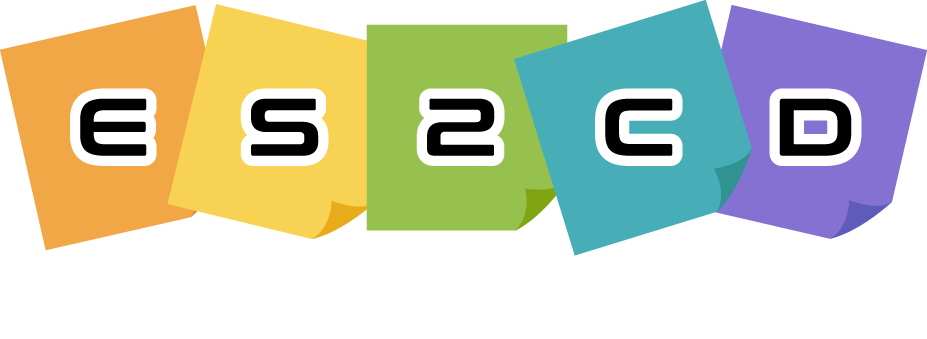

<!-- _coverpage.md -->

	

		

			

				
			

			

				by uEngine
			

			

				
EventStorming 2 Code

				
Online EventStorming  &  MSA Code generation Tool

				<a class="btn" href="#start">Get Started</a>
			

		

	
<!-- //topWrap -->
	

		

			

				
Collective Event Storming

				
				
이벤트스토밍은 사전 지식없이 단순 스티커(Sticker)만으로 수행하는 도메인 기반(Domain-driven Design) 시스템 분석/설계 기법입니다.  ES2CD는 이러한 이벤트스토밍이 온라인 상에서도 팀 작업이 가능하도록 고안된 웹 기반의 도구입니다.
					

			

				
Model 2 Code 2 Cloud

				
				
설계된 모델은 MDD(Model-driven Design) 패턴에 따라 MSA 코드로 변환됩니다. MSA 코드이외에 컨트랙트 테스트 Code, 도커 이미지 생성 스크립트 및 클라우드(GCP, AWS, Azure 등)에 즉시 배포 가능한 CI/CD 파이프라인 스크립트를 자동 생성해 줍니다.

			

			

				
Polyglot & Custom Template

				
				
MSA의 최대 장점 중 하나는 서비스별 최적의 기술 적용이 가능한 폴리글랏 아키텍처입니다.    ES2CD는 이벤트스토밍 결과, 식별된 마이크로서비스별 코드 생성이 가능하며, ‘사용자 정의 템플릿’을 통해, 다양한 언어 및 정보공학 노테이션(Notation)으로의 확장을 지원합니다.

			

		

	
<!-- //boxWrap -->

<!-- //allWrap -->

	Copyright © uEngine solutions. All rights reserved.

 