EventStorming2Code 사용 매뉴얼

+--------------------------+--+
| 2019\. 10                |  |
|                          |  |
| 유엔진솔루션즈           |  |
|                          |  |
| (http://www.uengine.org) |  |
+--------------------------+--+
|                          |  |
+--------------------------+--+
|                          |  |
+--------------------------+--+

[]{#_Toc476298152 .anchor}목 차

1.  [[목 차]{.underline} ii](#_Toc476298152)

<!-- -->

1.  [[EventStorimg2Code 매뉴얼은]{.underline}
    1](#eventstorimg2code-매뉴얼은)

<!-- -->

1.  [[1. 개요]{.underline} 2](#개요)

[[1.1 도구 소개]{.underline} 2](#도구-소개)

[[1.1.1 주요 Features]{.underline} 3](#주요-features)

[[1.1.2 도구의 목적]{.underline} 4](#도구의-목적)

[[1.1.2.1 시공간의 제약없는 이벤트스토밍 환경]{.underline}
4](#시공간의-제약없는-이벤트스토밍-환경)

[[1.1.2.2 MSA 코드 자동 생성]{.underline} 6](#msa-코드-자동-생성)

[[1.1.2.3 Polyglot MSA를 위한 User-defined 템플릿]{.underline}
7](#polyglot-msa를-위한-user-defined-템플릿)

[[1.1.3 도입 효과]{.underline} 7](#도입-효과)

[[1.1.4 실행 환경]{.underline} 8](#실행-환경)

1.  [[2. MSA 분석기법 -- DDD(Domain Driven Design)]{.underline}
    9](#msa-분석기법-ddddomain-driven-design)

[[2.1 DDD 개요]{.underline} 9](#ddd-개요)

[[2.1.1 도메인 모델]{.underline} 9](#도메인-모델)

[[2.1.2 Bounded Context (한정된 문맥)]{.underline}
10](#bounded-context-한정된-문맥)

[[2.1.2.1 도메인 모델과 경계]{.underline} 10](#도메인-모델과-경계)

[[2.1.2.2 Bounded Context]{.underline} 11](#bounded-context)

[[2.1.3 Ubiquitous Language (도메인 언어)]{.underline}
11](#ubiquitous-language-도메인-언어)

[[2.2 DDD구현을 위한 이벤스트밍 (EventStorming)]{.underline}
13](#ddd구현을-위한-이벤스트밍-eventstorming)

1.  [[3. 오프라인 이벤트스토밍(Event-Storming) 기반 MSA
    개발]{.underline}
    14](#오프라인-이벤트스토밍event-storming-기반-msa-개발)

[[3.1 개념]{.underline} 14](#개념)

[[3.2 수행 방법]{.underline} 14](#수행-방법)

[[3.2.1 스티커 유형]{.underline} 14](#스티커-유형)

[[3.2.1.1 Orange -- Event]{.underline} 15](#orange-event)

[[3.2.1.2 Lilac -- Policy]{.underline} 15](#lilac-policy)

[[3.2.1.3 Blue -- Command]{.underline} 15](#blue-command)

[[3.2.1.4 Yellow -- Aggregate]{.underline} 16](#yellow-aggregate)

[[3.2.2 Bounded Context 도출]{.underline} 16](#bounded-context-도출)

[[3.2.3 Context Mapping]{.underline} 17](#context-mapping)

[[3.2.3.1 Orchestration]{.underline} 17](#orchestration)

[[3.2.3.2 Choreography]{.underline} 18](#choreography)

[[3.2.4 마이크로서비스 구현]{.underline} 19](#마이크로서비스-구현)

[[3.2.4.1 Hexagonal Architecture]{.underline}
19](#hexagonal-architecture)

[[3.2.4.2 MSA Chassis]{.underline} 19](#msa-chassis)

[[3.2.4.3 이벤트스토밍 스티키 노트별 구현기술 적용]{.underline}
20](#이벤트스토밍-스티키-노트별-구현기술-적용)

1.  [[4. EventStorming2Code 기반 MSA 개발]{.underline}
    25](#eventstorming2code-기반-msa-개발)

[[4.1 예제 프로젝트]{.underline} 25](#예제-프로젝트)

[[4.2 UI 소개]{.underline} 25](#ui-소개)

[[4.2.1 도구 레이아웃]{.underline} 25](#도구-레이아웃)

[[4.2.2 Event]{.underline} 25](#event)

[[4.2.2.1 Event 추가하기]{.underline} 26](#event-추가하기)

[[4.2.2.2 Event 속성 설정]{.underline} 27](#event-속성-설정)

[[4.2.3 Policy]{.underline} 29](#policy)

[[4.2.3.1 Policy 추가하기]{.underline} 29](#policy-추가하기)

[[4.2.3.2 Policy 속성 설정]{.underline} 30](#policy-속성-설정)

[[4.2.4 Command]{.underline} 30](#command)

[[4.2.4.1 Command 추가하기]{.underline} 30](#command-추가하기)

[[4.2.4.2 Command 속성 설정]{.underline} 31](#command-속성-설정)

[[4.2.5 어그리게잇 (Aggregate)]{.underline} 32](#어그리게잇-aggregate)

[[4.2.5.1 어그리게잇 추가하기]{.underline} 32](#어그리게잇-추가하기)

[[4.2.5.2 어그리게잇 속성 설정]{.underline} 33](#어그리게잇-속성-설정)

[[4.2.6 Bounded Context]{.underline} 34](#bounded-context-2)

[[4.2.6.1 Bounded Context 추가하기]{.underline}
34](#bounded-context-추가하기)

[[4.2.6.2 Bounded Context 속성 설정]{.underline}
35](#bounded-context-속성-설정)

[[4.2.7 Relation]{.underline} 36](#relation)

[[4.2.7.1 Relation 추가]{.underline} 36](#relation-추가)

[[4.2.7.2 Relation 속성 설정]{.underline} 37](#relation-속성-설정)

[[4.2.8 EventStorming 결과]{.underline} 38](#eventstorming-결과)

[[4.2.9 코드 프리뷰]{.underline} 38](#코드-프리뷰)

[[4.2.9.1 코드 프리뷰 레이아웃]{.underline} 38](#코드-프리뷰-레이아웃)

[[4.2.10 다운로드 아카이브]{.underline} 39](#다운로드-아카이브)

[[4.2.11 빌드]{.underline} 41](#빌드)

[[4.2.11.1 다운로드 파일 구조 설명]{.underline}
41](#다운로드-파일-구조-설명)

[[4.2.11.2 선행사항]{.underline} 42](#선행사항)

[[4.2.11.3 실행]{.underline} 42](#실행)

[[4.2.12 클라우드 배포]{.underline} 42](#클라우드-배포)

[[4.2.12.1 Git 연동]{.underline} 42](#git-연동)

[[4.2.12.2 GCB Trigger 생성]{.underline} 43](#gcb-trigger-생성)

[[4.2.12.3 쿠버네티스 배포]{.underline} 45](#쿠버네티스-배포)

[[4.3 커스텀 템플릿 (Custom Template)]{.underline}
48](#커스텀-템플릿-custom-template)

[[4.3.1 개념]{.underline} 48](#개념-1)

[[4.3.2 템플릿 추가]{.underline} 48](#템플릿-추가)

[[4.3.2.1 템플릿 설명]{.underline} 48](#템플릿-설명)

[[4.3.2.2 템플릿 생성]{.underline} 48](#템플릿-생성)

EventStorimg2Code 매뉴얼은 {#eventstorimg2code-매뉴얼은 .ListParagraph}
==========================

###### 툴이 제공하는 기능의 이해를 돕기 위해 마이크로서비스(Microservices), 이벤트스토밍(EventStorming), 도메인 주도 개발(DDD, Domain Driven Design)에 대한 이론 Part가 초반부에 포함 되었고,  {#툴이-제공하는-기능의-이해를-돕기-위해-마이크로서비스microservices-이벤트스토밍eventstorming-도메인-주도-개발ddd-domain-driven-design에-대한-이론-part가-초반부에-포함-되었고 .ListParagraph}

###### 4장-EventStorming2Code -- 이벤트스토밍 도구. 에서는 툴의 기능을 소개하기 위해 누구나 보편적으로 인지하고 있는 쇼핑몰 예제 시나리오를 중심으로 작성 되었으며, {#장-eventstorming2code-이벤트스토밍-도구.-에서는-툴의-기능을-소개하기-위해-누구나-보편적으로-인지하고-있는-쇼핑몰-예제-시나리오를-중심으로-작성-되었으며 .ListParagraph}

###### 이벤트스토밍의 결과로 생성된 마이크로서비스가 Public Cloud 환경에서 정상적으로 빌드되고 배포되는 설명을 위해 Google Cloud Platform(GCP)의 일부 화면을 인용하고 있다. {#이벤트스토밍의-결과로-생성된-마이크로서비스가-public-cloud-환경에서-정상적으로-빌드되고-배포되는-설명을-위해-google-cloud-platformgcp의-일부-화면을-인용하고-있다. .ListParagraph}

개요
====

도구 소개
---------

EventStorming2Code 도구는 소프트웨어를 통한EventStorming(이벤트스토밍)
수행과 그 결과물인 스티커기반(Sticker-based) 모델을
마이크로서비스형(Microservices Native) 코드로 자동 생성해 주는 툴이다.

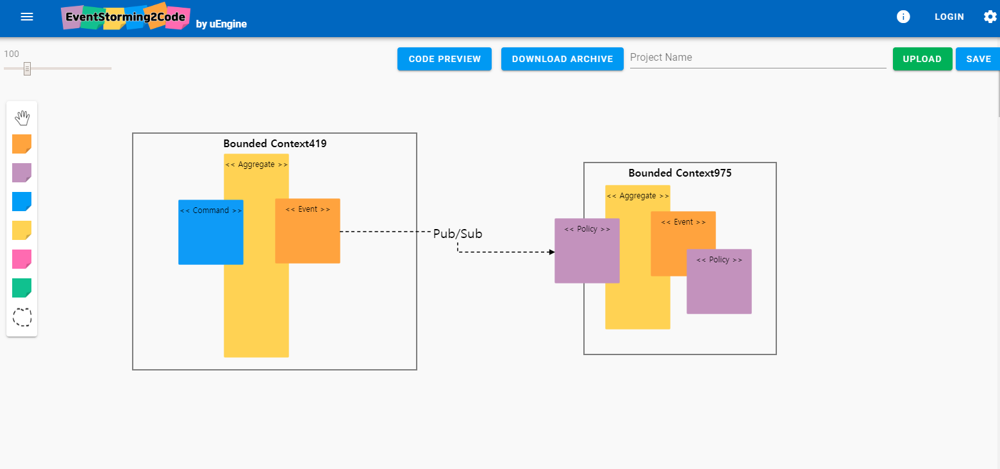{width="5.833333333333333in"
height="3.058333333333333in"}

그림 1 EventStorming2Code 도구 화면 (예시)

우리가 일반적으로 부르는 현업, 업무전문가, 도메인전문가 들이 모여
화이트보드 벽면에 주요 이벤트(Event)를 중심으로 업무들간의 상호 연관성을
찾기 위해 유일한 도구인 스티커(Sticker)를 가지고 협업해 나가는 과정을
이벤트스토밍(Event Storming, Event와 BrainStorming의 합성어)이라고 한다.

이벤트스토밍이란, 이벤트를 중심으로 이벤트를 유발시키는 행위(사용자의
의사결정)와 해당 이벤트에 연이어 반응하는 다른 액션들을 ^1)^모든 이해
관계자들이, ^2)^짧은 시간 내에, ^3)^시각적으로 모델링함으로써
궁극적으로는 마이크로서비스 구현에 필요한 통제가능한(Controllable)한
수준의 서비스 경계를 구분짓는 것을 그 목적으로 한다.

EventStorming2Code 도구는 이벤트스토밍에 필요한 공간적인 제약과,
화이트보드 벽면에 부착된 스티커가 외부적 요인으로 쉽게 분리(detach)될 수
있다는 점을 보완하여 브라우저(Browser)의 캔버스 상에서 오프라인에서와
동일한 작업이 가능한 환경을 제공한다.

또한, 이벤트스토밍 결과 모델을 도구가 제공하는 순공학(Forward
Engineering) 기능을 통해 단위 마이크로서비스 코드 생성이 가능하고,
도구를 적용하는 기업이 가진 표준 프레임워크(Framework)에 맞도록
커스터마이징 가능한 템플릿 기능도 내장하고 있으며, 마이크로서비스가
운영될 클라우드 환경에 필요한 도커(Docker)와 CI(Continuous
Integration)/CD(Continuous Deployment) 배포 파이프라인(Pipeline) 등
자동화된 환경구성(Configuration)도 제공한다.

### 주요 Features

-   Provide web-based Event Storming environment

    -   Support 6 types of Event Sticker\
        (Event, Policy, Command, Aggregate, External System, Read Model)

    -   Bounded Context and Context Mapping function

    -   Support ubiquitous Language function (English word suggestion)

    -   Support various reference type (Request & Response,
        Event-Driven)

-   Support Templates for Microservice's Polyglot language

    -   Template customizing support

    -   Local and remote(Github) template add-in support

-   Support Code preview & Download Archive

-   Support Canvas Zoom In-Out

### 도구의 목적

#### 시공간의 제약없는 이벤트스토밍 환경

> 온라인 서비스를 제공하는 회사들은 주로 야간에 업무 시스템 개선에 대한
> 서버 반영이 이루어지고 있으며, 한 팀의 개선 서비스 반영을 위해 연관된
> 다른 모든 팀들이 혹시 발생할 수 있는 Side Effect 모니터링을 위해
> 대기하는 상황을 흔히 볼 수 있다.
>
> 조직 구조가 에자일(Agile)해 지지 않으면 온라인 서비스 기업의 낮은 행복
> 지수를 유발하는 Pain-Point는 항상 존재하게 된다. 허나, 우리의 경쟁사
> 중 앞서가는 기업은 실패에도 관대하고 고객이 원하는 Features를 탐색해
> 볼 수 있는 요구사항 수집 방법과 소프트웨어 엔지니어링 방법, Loosely
> Coupled한 개발/운영 전략, DevOps와 같은 프로세스적인 아키텍처들을
> 겸비하고 있다.
>
> 아마존과 같은 고도의 경쟁체제에 있는 글로벌 기업은 하루에도 23,000여
> 번의 배포를 하면서도 서비스의 안정성과 고객의 신뢰도가 높으며,
> 배포(deploy) 시간도 짧게 가져가고 있다.

+-------------+-------------+-------------+-------------+-------------+
| > **Company | **Deploy    | > **Deploy  | > **Reliabi | > **Custome |
| **          | Frequency** | > Lead      | lity**      | r           |
|             |             | > Time**    |             | > Responsiv |
|             |             |             |             | eness**     |
+=============+=============+=============+=============+=============+
| > Amazon    | 23,000 /    | > Minutes   | > High      | > High      |
|             | day         |             |             |             |
+-------------+-------------+-------------+-------------+-------------+
| > Google    | 5,500 / day | > Minutes   | > High      | > High      |
+-------------+-------------+-------------+-------------+-------------+
| > Netflix   | 500 / day   | > Minutes   | > High      | > High      |
+-------------+-------------+-------------+-------------+-------------+
| > Facebook  | 1 / day     | > Hours     | > High      | > High      |
+-------------+-------------+-------------+-------------+-------------+
| > Twitter   | 3 / week    | > Hours     | > High      | > High      |
+-------------+-------------+-------------+-------------+-------------+
| > Typical   | Once every  | > Monthsor  | > Low /     | > Low /     |
| > enterpris | 9 months    | > quarters  | > Medium    | > Medium    |
| e           |             |             |             |             |
+-------------+-------------+-------------+-------------+-------------+

Table 1 출처 -- 도서 The Phoenix Project

> 규모가 상당한 기업이지만, 하루에도 수천 번의 배포가 가능한 이유는
> 이러한 배포가 상호 간섭없이 이루어 지고 있는 만큼 서비스 간의
> 격리(Isolation)가 잘 되어 있다는데 집중해야 한다.
>
> 기존의 모노리식 아키텍처는 큰 배포단위 속에 상호 모듈들의 의존도가
> 높을 뿐만 아니라 단일 DB를 사용함으로 인해, 사소한 개선 사항의
> 적용에도 표준 가이드라인 준수, 복잡한 결재 라인을 통한 승인 획득 등
> 지속적인 딜리버리에 많은 시간을 요구하고 있는게 현실이다.
>
> 그래서 등장한 것이 마이크로서비스 아키텍처이다. 마이크로서비스는
> 서비스를 함축적(Implementation Hiding)으로 제공하자는 측면에서는SOA
> 사상과 유사하나, 서비스레벨 뿐만 아니라 데이터베이스 레벨까지 철저하게
> 분리하자는 것이 SOA와 크게 구분되는 점이다. 기존에는 생산성을
> 극대화하기 위해 표준화를 목표로 하나의 정해진 언어, 잘 짜여진 개발
> 표준을 준수하면서 공통 모듈을 도출하고 이를 재사용하면서 공유해
> 왔으나, 빠르고 기민하게 요구사항을 받아들이고 반영하는 전체
> 라이프사이클 상에서 이러한 SOA사상인 표준화(Standardization)는 오히려
> 생산성을 저해하는 커다란 걸림돌이 되고 있다. 즉 개발 표준을 준수하기
> 위해, 예를 들어 MDM(Master Data Management)에 필드하나 추가하기 위해
> 담당자에게 요청 후, 평균 일주일을 기다려야 한다는 것이다.

###### 기존의 approach는 빅(big) 플래닝을 통해 빅뱅(Big Bang)의 성공을 이루려는 프로세스 적용으로 실패에 대한 리스크 또한 높았으나, 아마존을 비롯한 글로벌 기업들은 고객이 실제 우리 제품에 대해 관심이 있는지를 빠른 시장출시를 통해 파악한 후, 관심과 호응도가 높을 시에 제대로 구현해 보자는 "Fail Fast", "Fail Cheap"의 에자일한 접근법을 선호하고 있는데 이러한 approach가 바로 마이크로서비스 전략인 것이다. 

> 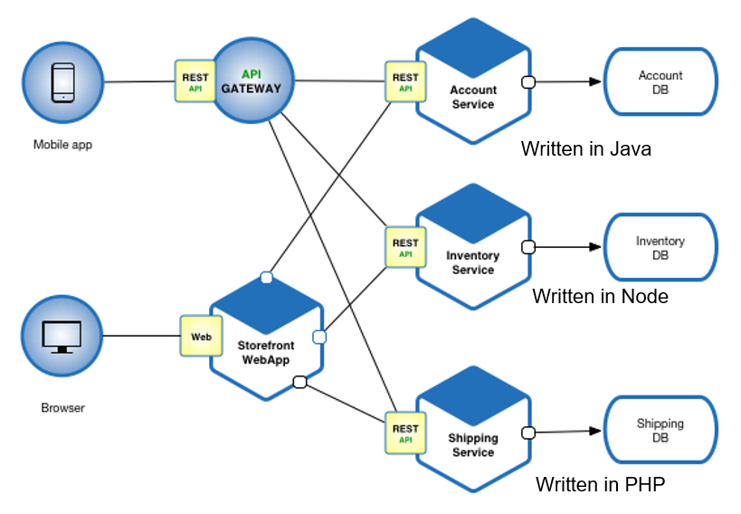{width="4.958333333333333in"
> height="3.441666666666667in"}

그림 2 마이크로서비스 아키텍처

> 위 그림과 같은 직접 호출 기반의 마이크로서비스 아키텍처가 서비스
> 레벨의 자율성과 독립성, 서비스에 최적화된 저장소(Polyglot
> Persistence)을 보장해 주지만, 한가지 큰 맹점이 존재하는데 그게 바로
> 서비스의 동기 호출에 따른 타임 커플링(Time Coupling)은 해결해 주고
> 있지 못하다.

아래 그림의 쇼핑몰 서비스간 흐름을 보면, 직접 호출 대신 Publish,
Subscribe 방식으로 상호 커뮤니케이션하고 있음을 나타내고 있다.

> 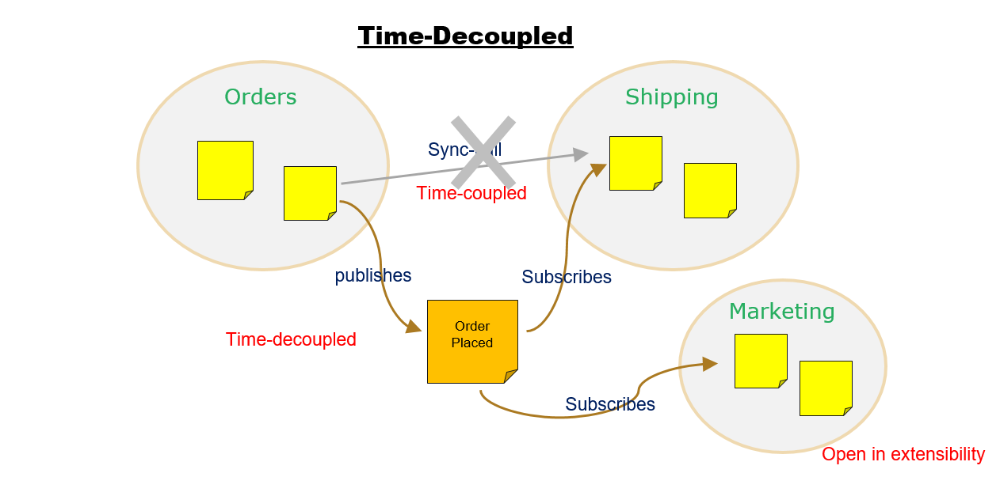{width="6.491666666666666in" height="3.1in"}

그림 3 타임 커플링이 배제된 이벤트드리븐 아키텍처

> 위 그림에서 주문팀에서 주문이 발생하였을 때, 직접 배송팀에다 ''배송을
> 준비하세요.'라고 전달하는 것은 주문팀의 입장에서는 그다지 중요한 것이
> 아니다. 즉, 다시 말해 주문팀은 배송팀이 배송을 하던 말던 관심이 없다는
> 것이다.
>
> REST방식(직접 호출)으로 서로 통신할 경우, 호출하는 링크가 깨질 수
> 있고, 요청을 보냈을 때 요청자는 다음 액션을 수행하기 위해 응답이
> 도착할 때까지 기다려야 하는 블로킹(Blocking) 상황이 일어난다. 그러나
> 타임 커플링이 배제된 환경에서 주문팀은 발생한 사실에 대해 비동기 기반
> 큐(single Source Of Truth)에 "주문이 발생하였습니다." 라고 신고만
> 함으로써 그 의무를 다하게 되고 다음 액션을 수행하면 된다. 이처럼
> "발생한 사실을 신고"하는 패턴의 아키텍처를 이벤트드리븐(Event Driven),
> 또는 화이트보드 패턴이라고 한다.
>
> 그렇게 되면 마이크로서비스 직접호출 패턴에선, 배송팀의 비즈니스
> 프로세스가 주문팀이 호출해 실행되던 방식에서, 배송팀이 직접 이벤트에
> 반응하여 실행하는 방식으로 실행 주체가 바뀌게 된다. 마케팅팀 또한,
> 주문팀의 주문 발생으로 수행해야 할 비즈니스 프로세스가 있다면,
> 단순하게 주문팀의 "주문이 발송하였습니다." 라는 이벤트에 대해
> 마케팅팀도 반응하여 수행하면 된다는 것이다.
>
> 이러한 [이벤트 기반 마이크로서비스(Event-Driven Microservice) 구축에
> 앞서, 단순 스티커(Sticker) 색상으로 화이트보드 벽면에 모델링하는
> 기법을 이벤트스토밍(Event Storming)이라 하며, EventStorming2Code 툴은
> 이를 소프트웨어적으로 수행될 수 있는 환경을 제공하는 것이 그
> 목적]{.underline}이다.

#### MSA 코드 자동 생성

EventStorming2Code(이하, ES2Cd) 도구를 통해 수행된 이벤트스토밍 결과는
도구의 순공학(Forward Engineering) 코드생성 모듈을 통해 MSA 소스코드로
자동 생성되며, 각 마이크로서비스마다 서비스에 최적화된 Language(Python,
Node JS, Go 등)를 위한 사용자 정의가능한 확장 템플릿을 지원한다.

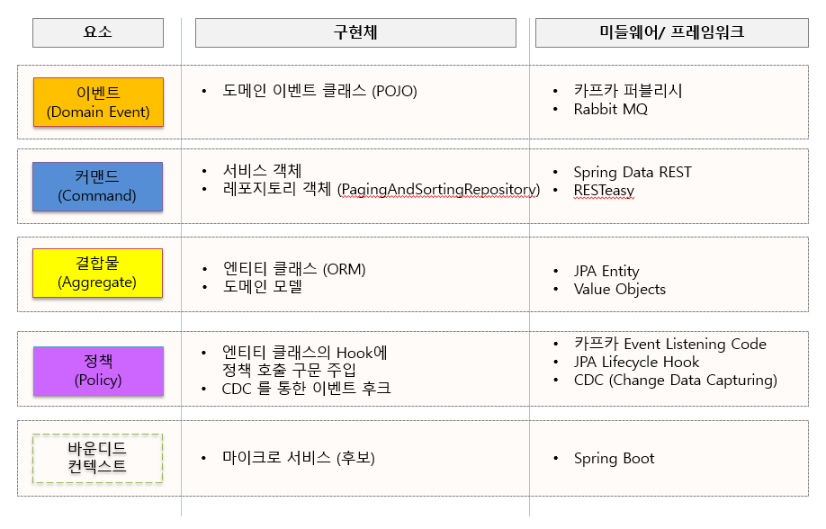{width="6.491666666666666in"
height="3.4166666666666665in"}

그림 4 이벤트스토밍 결과와 소스코드 구현체의 상관관계

또한, ES2Cd 도구는 워크로드 분산 엔진(Workload Distribution Engine)
기반의 클라우드 배포를 위한 Dockerfile과 CI/CD 파이프라인, 심지어 Helm
Chart 스크립트까지도 자동으로 생성해 준다. 즉, ES2Cd 도구를 사용함으로써
MSA 소스코드는 물론, DevOps에 필요한 모든 메타 정보(Configuration)도
아카이브 파일에 포함되어 다운로드 된다.

#### Polyglot MSA를 위한 User-defined 템플릿

과거 모노리식 어플리케이션은 간단한 경우, 어플리케이션 서버와 DB서버
두개만 관리하면 되지만, MSA에서는 기본적으로 한 서버에 하나의 서비스만
실행되므로, 서비스 수만큼의 이기종 인스턴스 서버와 각 서비스에 최적화된
데이터베이스 적용이 가능하다. 즉 모든 서비스마다 반드시 동일한 개발
언어, 동일한 프레임워크로 구성될 필요가 없는 것이다.

예를 들어 TPS(시간당 트랜잭션)가 높고, 읽기 작업이 많은 MSA서비스는
Node, Redis 기반으로 구현하고, 트랜잭션 및 안정성이 중요한 MSA
서비스에는 Spring, RDB를 적용할 수 있는데 이를 'Polyglot
Architecture(폴리글랏 아키텍처)' 라고 한다.

ES2Cd 도구는 이러한 폴리글랏 아키텍처를 지원하기 위해 팀플릿 기반 MSA
코드 생성을 지원한다. ES2Cd의 커스텀 템플릿 기능을 활용하여 기본 제공
템플릿 외에 개발자가 템플릿을 추가하여 EventStorming결과가 원하는
템플릿에 맞추어 코드가 생성될 수 있도록 한다.

커스텀 템플릿의 자세한 내용은 [4.3 커스텀 템플릿 (Custom
Template)]{.underline}에서 설명한다.

### 도입 효과

ES2Cd 도구는 이벤트스토밍(EventStorming)이라는 DDD 구현 방법론이 가지는
장점들을 그대로 가지면서 이벤트스토밍에 필요한 충분한 공간적인 요소가
요구되지 않고, 벽면에 부착되는 다양한 스티커 노트들의 분실 및 훼손의
우려가 없다.

  **구 분**            **오프라인 EventStorming**                         **ES2Cd**
  -------------------- -------------------------------------------------- ------------------------------------------
  Support Lifecycle    분석, 설계                                         분석, 설계, 개발, 운영
  시공간적 제약        충분한 화이트보드 공간 필요                        제약 없음
  MSA 코드 구현        MSA 구현 스킬을 보유한 개발자에 의한 수작업 개발   도구에서 초기 소스코드 자동생성
  Ployglot MSA         팀별 자체 구현                                     사용자정의 확장 템플릿으로 자동생성 지원
  DevOps 지원          없음                                               CI/CD 파이프라인 자동생성
  결과물 관리 용이성   분실 및 훼손 우려 높음                             결과물 버전관리 및 전자적 보관

표 1이벤트스토밍 도구 도입효과

오프라인 이벤트스토밍으로 DDD기반 도메인 분석 및 설계가 가능하지만,
ES2Cd는 분석에서부터 운영에 이르는 MSA 전 주기를 지원한다. 기존 MSA
스킬을 보유한 개발자가 직접 수작업으로 개발하던 소스코드는 도구에서 초기
소스코드를 자동으로 생성해 주며, 오프라인 이벤트스토밍에서는 불가능한
결과물 버전관리와 수행 결과물의 전자적 보관은 소프트웨어 기반의
이벤트스토밍 툴인 ES2Cd가 제공하는 당연한 이점이다.

### 실행 환경

+--------------+---------------------------------------------------+
| 지원 OS      | Windows, Linux, Mac OS 지원                       |
+==============+===================================================+
| 지원 Cloud   | All Cloud Platform 지원                           |
|              |                                                   |
|              | (AWS, GCP, MS Azure, IBM/Oracle Cloud, OpenShift) |
+--------------+---------------------------------------------------+
| 서비스 유형  | On-Premise, or SaaS                               |
+--------------+---------------------------------------------------+
| 필요 사양    | Memory 512MB 이상                                 |
+--------------+---------------------------------------------------+
| 지원 Browser | 크로스 브라우저 지원 (IE, Edge 등 MS계열 제외)    |
+--------------+---------------------------------------------------+
| 설치 모듈    | 없음                                              |
+--------------+---------------------------------------------------+

표 2EventStorming2Code 실행 환경

MSA 분석기법 -- DDD(Domain Driven Design)
=========================================

DDD 개요
--------

소프트웨어의 개발이 어려운 이유는 현실세계 문제의 복잡성에서 시작된다.
개발자가 소프트웨어를 구현하는 활동인 개발 언어(Java, Python, .net)를
활용한 코딩, 수행 도구 및 라이브러리의 활용에서 비롯되는 복잡성보다
소프트웨어로 구현하고자 하는 기능에 대한 본질적인 복잡성이 더 크다.

그래서 현실 세계의 문제(업무)를 가장 잘 이해하는 해당분야 전문가(도메인
전문가)와 개발자 사이의 소통을 중심으로 특정 도메인을 개념적으로 표현한
도메인 모델을 통해, 여러 관계자들이 동일한 모습으로 도메인을 이해하고,
도메인 지식을 공유하는 것이 중요하다. 고객의 요구사항이 도메인 모델로
유연하게 설계되고, 이 모델로부터 구현이 자연스럽게 연결되어야 한다는
사상이 **Domain Driven Design**인 것이다.

이때, 가장 중요한 점은 여러 하위(서브) 도메인을 하나의 다이어그램에
모델링하면 안되고, 각 서브 도메인마다 별도로 모델을 만들어야 한다.
모델의 각 구성요소는 특정 도메인을 한정할 때 비로소 의미가 완전해지기
때문이다.

쇼핑몰에서도 상품 도메인에 존재하는 상품과 주문, 배송 도메인에 존재하는
상품은 의미가 다르다.

### 도메인 모델

> 도메인 모델에는 다양한 정의가 존재하는데 기본적으로 도메인 모델은 특정
> 도메인을 개념적으로 표현한 것이다. 예를 들어, 주문 도메인을 생각해
> 보면, 온라인 쇼핑몰에서 주문을 하려면 상품을 몇 개 살지 선택하고
> 배송지를 입력한다. 선택한 상품 가격을 이용해서 총 지불 금액을 계산하고
> 금액 지불을 위한 결제 수단을 선택한다.
>
> 주문한 뒤에도 배송 전이면 배송지 주소를 변경하거나 주문을 취소할 수
> 있다. 이를 위한 주문 모델을 객체 모델로 구성하면 아래와 같다.
>
> 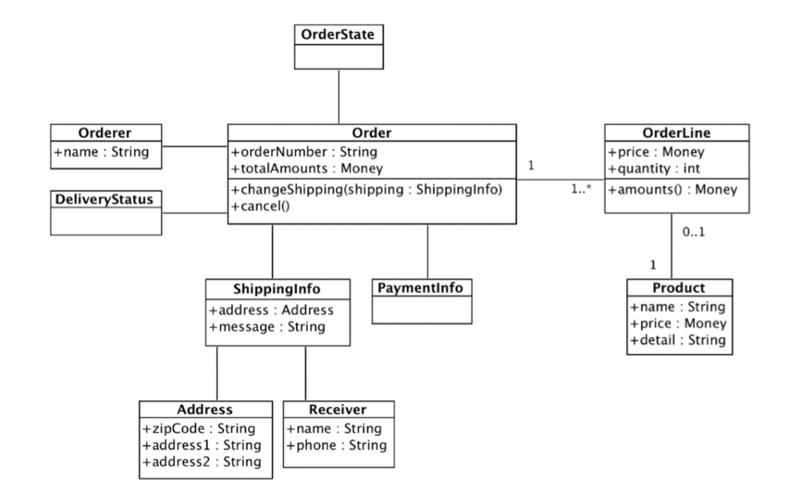{width="5.791666666666667in" height="3.025in"}

그림 5 객체 기반 주문 도메인 모델

위 그림의 객체 모델은 도메인의 모든 내용을 담고 있지는 않지만 이 모델을
보면 주문(Order)은 주문번호와 지불할 총금액이 있고, 배송정보(Shipping)를
변경할 수 있음을 알 수 있다. 또한, 주문을 취소(cancel)할 수 있다는 것도
알 수 있다. 즉, 도메인 모델을 사용하면 여러 관계자들이 동일한 모습으로
도메인을 이해하고 도메인 지식을 공유하는데 도움이 된다.

위 그림은 객체를 이용한 도메인 모델이다. 도메인을 이해하려면 도메인이
제공하는 기능과 도메인의 주요 데이터 구성을 파악해야 하는데, 이런 면에서
기능과 데이터를 함께 보여주는 객체 모델은 도메인을 모델링하기에
적합히다.

이러한 도메인은 다수의 하위 도메인으로 구성된다. 각 하위 도메인이 다루는
영역은 서로 다르기 때문에 같은 용어라도 하위 도메인마다 의미가 달라질 수
있다. 예를 들어, 상품 도메인의 상품이 상품가격, 상품이미지 URL, 재고
수량 등의 상세 내용을 담고 있는 '정보'를 의미한다면 배송 도메인의 상품은
고객에게 실제 배송되는 '물리적인 상품'을 의미한다.

도메인에 따라 용어의 의미가 결정되므로, 여러 하위 도메인을 하나의
다이어그램에 모델링하면 안된다. 상품과 배송 도메인 모델을 구분하지 않고
하나의 다이어그램에 함께 표시한다면, 다이어그램에 표시한 '상품'은 상품
도메인의 상품인지, 배송 도메인의 상품인지 제대로 이해하는데 방해가 된다.

모델의 각 구성요소는 특정 도메인을 한정(Bounded)할 때, 비로소
의미(Context)가 완전해지기 때문에, '상품'의 의미가 통용되는 경계를
구분(Bounded Context)하고 그 경계 내에서 별도로 도메인 모델을 만들어야
한다.

### Bounded Context (한정된 문맥)

#### 도메인 모델과 경계

상품 도메인에서의 상품, 배송 도메인에서의 상품, 주문 도메인에서의 상품은
이름만 같지만 실제로 의미하는 것이 다르다. 상품 도메인에서의 상품은 상품
이미지, 상품명, 상품 가격, 상품 상세 설명과 같은 상품 정보가 위주라면
주문 도메인에서의 상품은 주문 대상이 되는 객체이며, 배송 도메인에서의
상품은 고객에게 배송되는 물리적 상품을 나타낸다. 또한, 상품 도메인에서
물리적으로 하나인 상품은 주문 및 배송 도메인에서는 여러 개 존재할 수
있다.

논리적으로 같은 존재처럼 보이지만, 하위 도메인에 따라 다른 용어를
사용하는 경우도 있다. 시스템을 사용하는 사람을 회원도메인에서는
회원이라고 부르지만, 주문 도메인에서는 주문자라고 부르고, 배송
도메인에서는 보내는 사람이라 부르기도 한다.

SW 도메인과 건축 도메인에서도 동일한 용어지만 두 도메인 내에서의 의미가
서로 다른 예를 찾을 수 있는데, SW도메인에서의 '프로젝트'는 현업이
요구하는 시스템을 개발하기 위한 전체 과정을 일컫는다면, 건축
도메인에서의 '프로젝트'는 사람이 주거하기 위한, 또는 생업에 필요한
건축물을 짓는 과정이다.

'아키텍처'란 용어도 SW도메인에서는 서버, 네트워크, 소프트웨어
구성도나ERD, UML과 같은 다이어그램 등을 지칭하나 건축 도메인에서의
'아키텍처'는 건축물 구축에 필요한 평면도와 같은 설계 도면을 의미한다.

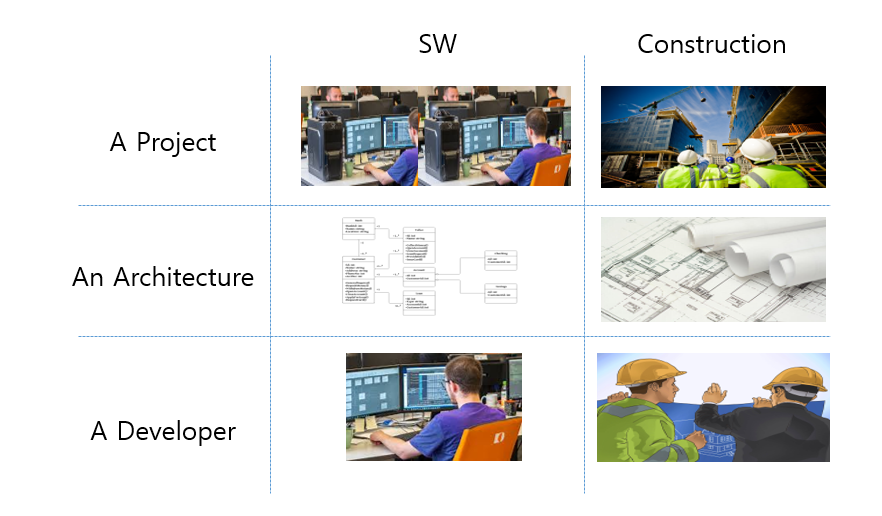{width="5.5in" height="3.216666666666667in"}

그림 6 동일 용어이나 서로 다른 도메인마다 상이한 의미

이렇게 하위 도메인마다 같은 용어라도 의미가 다르고 같은 대상이라도
지칭하는 용어가 다를 수 있기 때문에 한 개의 모델로 모든 하위 도메인을
정확하게 표현할 수는 없으며, 올바른 도메인 모델을 개발하려면 하위
도메인마다 모델을 만들어야 한다.

이 때, 각 모델은 명시적으로 구분되는 경계를 가져서 섞이지 않도록 해야
한다. 왜냐하면 여러 하위 도메인이 섞어기 시작하면 모델의 의미가 약해질
뿐만 아니라 여러 도메인의 모델이 서로 얽혀 있기 때문에 각 하위
도메인별로 민첩한 고객 요구 대응 및 반영이 어려워진다.

#### Bounded Context

모델은 특정한 경계 문맥(컨텍스트) 내에서 정확히 구분 가능한 완전한
의미를 가지는데 이렇게 구분되는 경계를 DDD에서는 **Bounded Context**
라고 부른다. 즉, 바운디드 컨텍스트는 동일한 컨텍스트의 범위를
표현하는경계로 해당 범주 내에서 모델은 특정한 의미를 갖고 특정한 일을
수행한다.

DDD에서는 복잡하고 규모가 커지면 맥락의 경계를 명확하게 정의하라고
제안하는데, 그런 구분단위가 바운디드 컨텍스트인 것이다.

바운디드 컨텍스트는 모델의 경계를 결정하며 한 바운디드 컨텍스트는
논리적으로 하나의 모델을 갖는다. 바운디드 컨텍스트는 용어를 기준으로
구분하는데 상품 컨텍스트와 재고 컨텍스트는 서로 다른 용어를 사용함으로
이 용어를 기준으로 컨텍스트를 분리할 수 있다.

이상적으로 하위 도메인과 바운디드 컨텍스트가 1:1 관계이면 좋으나,
일반적으로 기업의 조직구조에 따라 결정된다. 예를 들어, 주문 서브 도메인
내에도 주문을 처리하는 팀과 결제를 관리하는 팀이 따로 있다고 할 때, 주문
서브 도메인 내에는 두개의 바운디드 컨텍스트가 존재 할 수 있다.

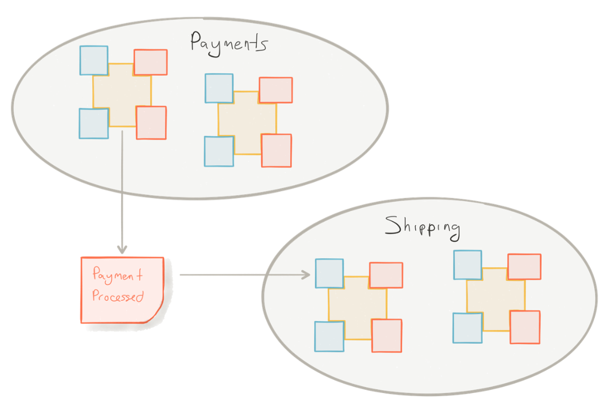{width="5.25in"
height="3.558333333333333in"}

그림 7경계가 구분된 두 개의 바운디드 컨텍스트

바운디드 컨텍스트는 도메인 모델을 구분하는 경계가 되기 때문에 바운디드
컨텍스트는 구현하는 서브 도메인에 알맞은 모델을 포함한다. 같은 상품이라
하더라도 상품 바운디드 컨텍스트와 주문 바운디드 컨텍스트의 '상품'은 각
컨텍스트에 맞는 모델을 가진다.

### Ubiquitous Language (도메인 언어)

도메인 모델을 정확히 구분짓는 경계인 바운디드 컨텍스트내에는 다양한 이해
관계자들이 존재한다. 도메인 업무에 능통한 도메인 전문가, 개발이 가능한
뼈대를 세우는 아키텍트, 실제 서브 도메인 서비스를 구축하는 개발자가
포함될 수 있으며 이들은 담당하는 각 서브 도메인의 모든 책임을 가진다.

이러한 각 도메인별 소속 구성원들 간에는 원활한 의사 소통에 필요한 보편적
언어가 사용되는데 이를 도메인 언어, 또는 유비쿼터스 언어(Ubiquitous
Language)라고 한다.

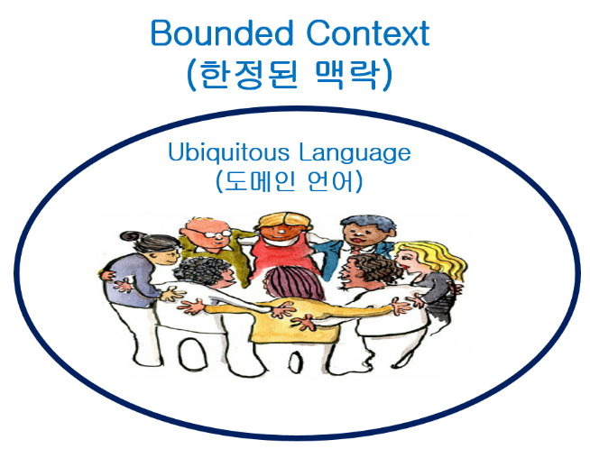{width="2.972916666666667in"
height="2.2618055555555556in"}

다시말해, 한정된 맥락인 Bounded Context 내에서 협업 구성원들간
보편적으로 통용되는 도메인 언어가 유비쿼터스 언어이다.

이러한 도메인 언어가 없다면, 예를 들어 개발자는 A라는 용어를 쓰는데
도메인 전문가가 이를 이해하지 못한다면 도메인 전문가에게 설명을 위한
번역 비용이 추가로 들게 된다.

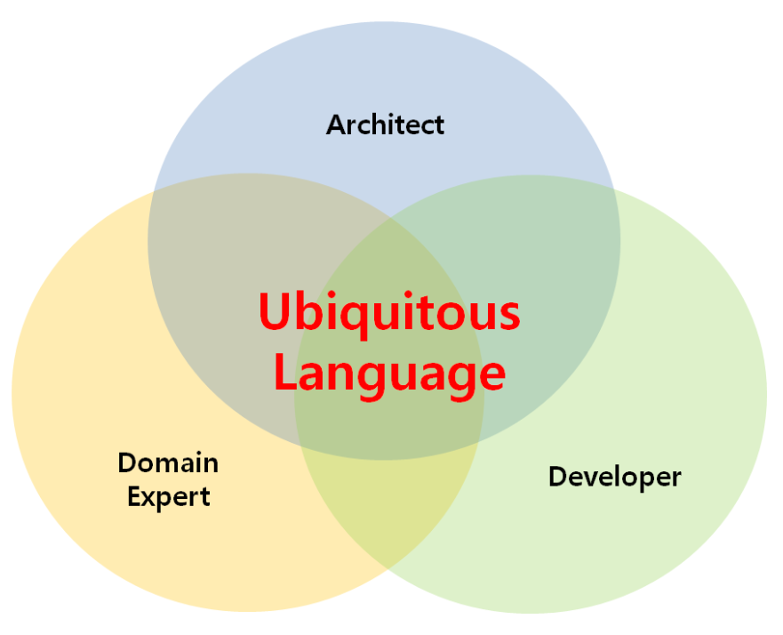{width="4.65in" height="3.7666666666666666in"}

그림 8유비쿼터스 언어는 바운디드 컨텍스트내에 통용되는 도메인 언어

구성원 간 각자의 언어를 사용하는 경우, 의사소통에 비용이 들 뿐만 아니라,
상대방이 내뱉은 단어를 내가 사용하는 단어로 번역해서 이해해야 하고, 협의
내용을 공유할 때에도 각자 해석이 분분한 지점이 없도록
네임스페이스(수식어)를 달아야 한다. 즉, 커뮤니케이션의 오류가 프로젝트
진행의 병목 지점이 되는 것이다.

의사소통은 물론, 이벤트스토밍, 도메인 모델링, 프로그램 개발에 이르기까지
일관된 용어로 커뮤니케이션, 문서뿐만 아니라 코드에까지 유비쿼터스 언어가
사용되어야 바운디드 컨텍스트의 경계가 유지되는 것이다.

 DDD구현을 위한 이벤스트밍 (EventStorming)
------------------------------------------

이벤트스토밍은 Event와 BrainStorming의 합성어로 Domain Expert와 개발
전문가가 함께 모여 워크샵 형태로 진행되는 방법론이다. DDD 방법론 중,
복잡한 UML다이어그램이나 도구 없이 수행할 수 있어 MSA를 구현하는데 가장
최적의 접근법이다.

이벤트스토밍은 시스템에서 발생하는 이벤트를 중심(Event-First)으로
분석하는 기법으로 특히, Non-Blocking, Event-driven한 MSA 기반 시스템을
분석에서 개발까지 필요한 도메인에 대한 빠른 이해를 도모하는데 유리하다.

기존의 유즈케이스나 클래스 다이어그래밍 방식은 고객 인터뷰를 통해
요구사항을 정제하고, 상세 설계를 통한 엔티티 구조를 인지하는
방식이었으나, 이벤트스토밍은 별다른 사전 훈련된 지식과 도구없이 진행할
수 있다.

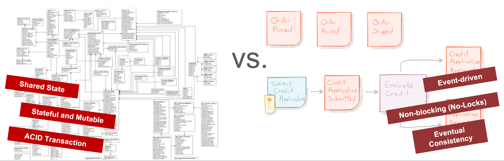{width="6.491666666666666in"
height="3.058333333333333in"}

그림 9 UML객체 기반 모델링과 이벤트스토밍 방법론 비교

진행 과정은 참여자 워크숍 방식의 방법론으로 결과는 스티키 노트를 벽에
붙힌 것으로 결과가 남으며, 오렌지 스티키 노트들의 연결로 비즈니스
프로세스가 도출되고 이들을 이후 BPMN과 UML등으로도 정재하여 전환할 수
있다.

오프라인 이벤트스토밍(Event-Storming) 기반 MSA 개발
===================================================

개념
----

ㅇㅇ

수행 방법
---------

1.  domain expert 와 개발 전문가와 함께 서로간의 질문을 하는 미팅 시간을
    가진다.

2.  포스트잇에 색깔에 따라 events, commands, policies, processes,
    errors, roles, aggregates, etc 등을 적어 놓는다.\
    본 미팅은 event storming 이므로 이벤트를 시간의 순서에 따라
    어플리케이션에서 발생 가능한 주요한 이벤트들을 나열한다.\
    가령 쇼핑몰의 경우 상품 열람 =\> 상품 구매 =\> 상품 배송 =\> 배송
    완료 처럼 디테일한 이벤트들을 순서대로 나열한다.

3.  다음은 이러한 이벤트들의 포스트잇 주변에 연관된 system action, user
    action 등을 쭉 붙인다.

4.  이러한 과정이 마무리 되면 이제 bounded context 를 찾을 시간이다.\
    나열된 리스트를 보면 어느정도 분리된 subdomain 들이 보이게 되는데
    가령 catalog, payments, delivery 등의 subdomain이 될 수 있다.

### 스티커 유형

ㅇㅇ

{width="6.5in" height="3.2333333333333334in"}

그림 10이벤트스토밍 스티커 유형

#### Orange -- Event

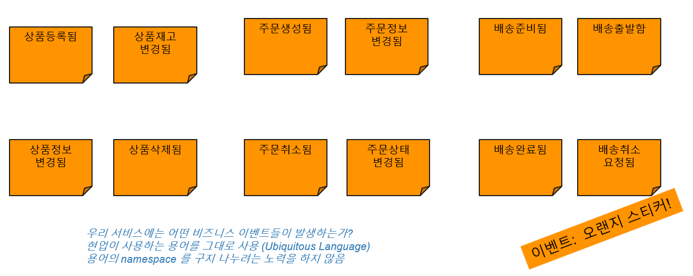{width="6.491666666666666in"
height="3.058333333333333in"}

그림 11 Event 예시

#### Lilac -- Policy

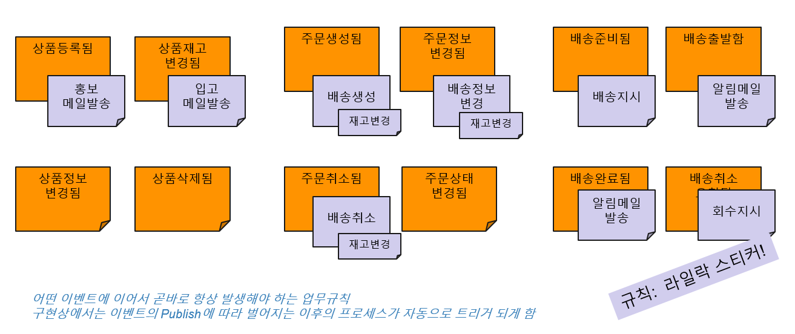{width="6.5in" height="3.1333333333333333in"}

그림 12 Policy 예시

#### Blue -- Command

{width="6.5in" height="3.25in"}

그림 13 Command 예시

#### Yellow -- Aggregate

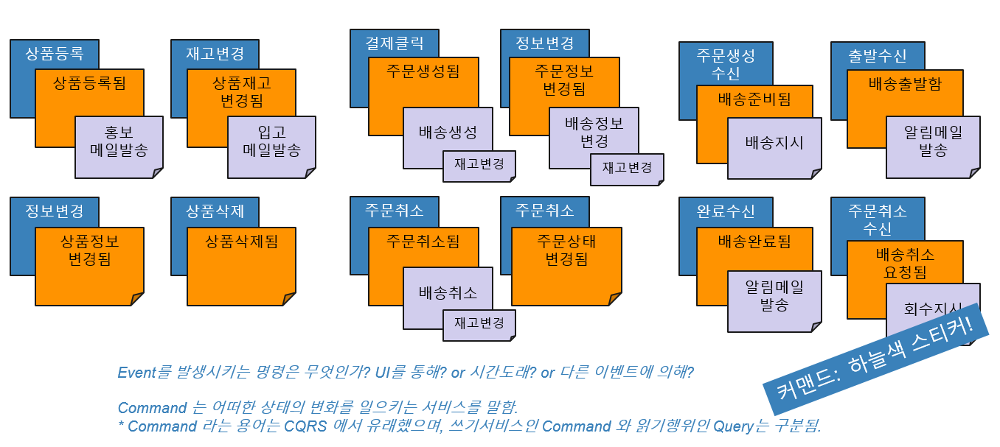{width="6.491666666666666in" height="3.2in"}

그림 14 Aggregate 예시

### Bounded Context 도출

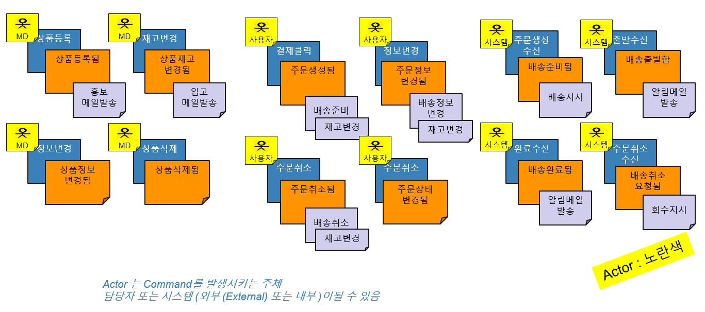{width="6.491666666666666in" height="3.35in"}

그림 15 Bounded Context 예시

### Context Mapping 

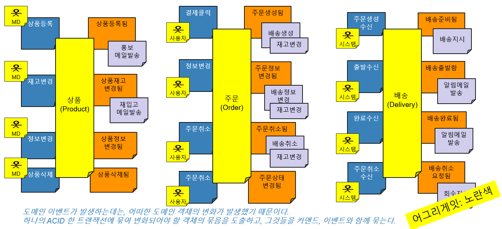{width="6.5in" height="3.4916666666666667in"}

그림 16 Context Mapping 예시

#### Orchestration

{width="6.358333333333333in" height="3.6in"}

그림 17 Policy Topology -- Orchestration

#### Choreography

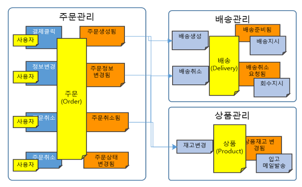{width="6.45in" height="3.575in"}

그림 18 Policy Topology - Choreography

### 마이크로서비스 구현

#### Hexagonal Architecture

아래와 같은 육각형 모형의 아키텍쳐 도형을 헥사고날 아키텍쳐라고 한다.
이는 가운데 영역인 비지니스 로직 (도메인 영역) 을 손상시키지 않고
프로그램을 구성하겠끔 고안된 아키텍처이다. 비지니스 로직을 손상시키지
않고 프로그램을 구현하기 위해서는 비지니스 로직에 특정 프로토콜이나
프로그램에 종속적인 코드가 들어가면 안된다. 예를들어 데이터베이스에
종속적인 Query 를 직접 사용하였다면, 데이터베이스가 변경되는 상황이
발생한다면 해당 로직은 모두 다시 만들어야 한다. 마찬가지로
메세지브로커를 사용하는 경우 특정 브로커의 코드를 직접적으로 사용하면
변경이 생길때나, 여러 브로커를 사용하는 경우가 생기면, 다시 구현을
해야하는 이슈가 생기게 된다.

이처럼 비지니스 로직은 순수한 형태로 구현을 하고, 그 이외의 것을 adapter
형식으로 설계를 하여 해당 비지니스 로직이 어느 환경에서도 잘 동작하도록
설계한 모형이 헥사고날 아키텍쳐이고, 마이크로 서비스 아키텍쳐에서는
이와같은 방식을 지향한다.

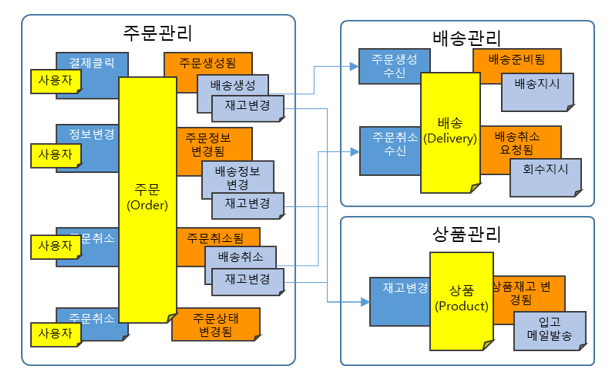{width="6.5in"
height="4.841666666666667in"}

#### MSA Chassis

MSA Chassis 라는 말은 마이크로 서비스를 구축할때 필요한 주변 요소들을
일컫는다. 마치 창틀처럼 이것저것 끼워넣는다로 해석할수도 있다. 위에
설명한 헥사고날 아키텍처로 설계를 하여 비지니스 로직에 영향이 없는
개발을 맨땅에서 하려면 많은 공수가 필요하다. 이에 많은 프레임워크들이
이와같은 패턴들을 구성해 놓고 제공중이다.

Java 계열에서 가장 선두주자인 Spring 프레임워크에서 마이크로 서비스에
적합한 spring-boot 프레임워크를 내어 놓았고, 이에 여러가지 어뎁터들에
해당하는 프로젝트들이 존재한다. 아래 그림은 헥사고날 아키텍쳐에
spring-boot 를 기반으로 한 MSA Chassis 를 입힌 모형이다.
Spring-Data-Rest 를 사용하여 Data 를 외부와 Rest 방식으로 연결시키고 ,
String-Cloud-Stream 으로 메세지 처리를 하는 로직을 구현하여 특정
브로커에 종속적이지 않은 adapter 패턴으로 구현된 모형이다.

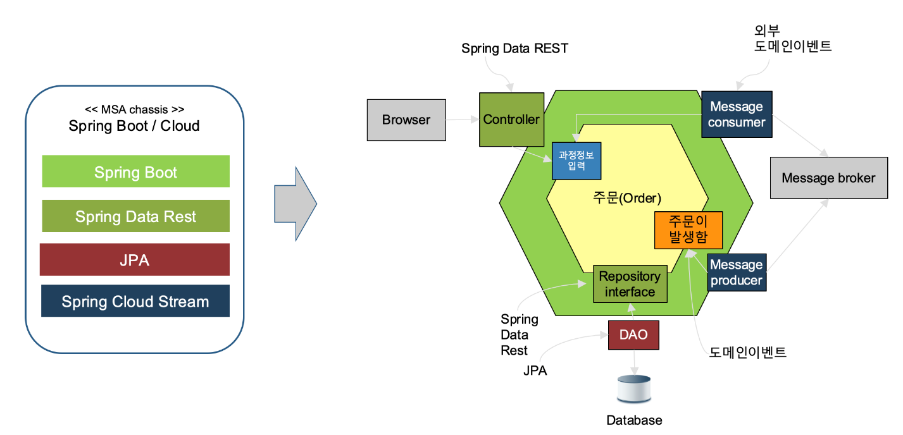{width="6.483333333333333in"
height="3.125in"}

#### 이벤트스토밍 스티키 노트별 구현기술 적용

##### Aggregate - Yellow

1)  이벤트 스토밍의 첫번째 구현은 도메인 모델을 정의하는 단계이다.\
    노란색 스티커로 붙여진 Aggregate 의 변화에 의하여 이벤트가 생성되고,
    커맨드 요청을 받아서 Aggregate 가 변화를 하기 때문에, Aggregate 는
    가장 중요하고, 가장 먼저 구현을 한다.

> Aggregate 를 구현시 Java 언어로 Spring-boot 를 사용하여 구현을 한다면
> 아래와 같이 Java 클레스에 \@Entity 어노테이션을 선언해 주면 준비가
> 완료된다.
>
> Entity 라는 말은 객체 혹은 개체 라는 의미로 사용되는데 연필이나 컴퓨터
> 처럼 서로 구별이 되는 하나하나의 대상을 지칭한다. 즉 우리가 사용하는
> 도메인 언어이다. Spring 에서는 이런 도메인을 손쉽게 사용할수 있도록
> 어노테이션을 제공하여 준다.
>
> 어노테이션 선언 후에 Entity 구성에 필요한 속성들을 정의하여 주면 된다.
> 속성들은 java 언어에서는 변수로 선언을 해주면 된다.
>
> 모든 Entity 는 각 개체마다의 생성되고, 변화되고, 사라지는 lifecycle 을
> 가지고 있고, 속성이 있기에, 프로그래밍 언어로 보았을때 데이터베이스와
> API 와의 매칭이 당연시 된다.
>
> Aggregate 에 포함된 특정 Entity 를 RootEntity 혹은 AggregateRoot 라고
> 부른다,
>
> 아래 그림은 노란색의 이벤트 스토밍 스티커인 Aggregate 를 구현한
> 모습이다.
>
> 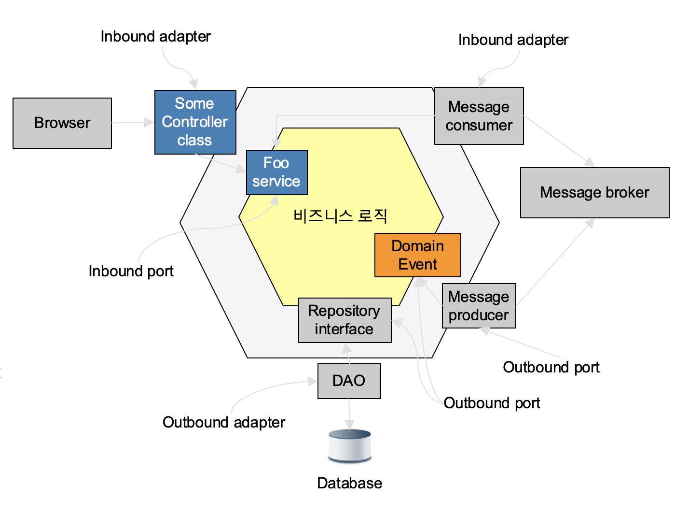{width="6.483333333333333in"
> height="3.025in"}

##### Command -- Sky Blue

1)  Aggregate 를 구성하였으면, 해당 Aggregate 를 변화시키는 커맨드를
    작성한다.

> 파란색 스티커에 해당하는 Command 는 구현관점으로 보았을때 외부로부터
> 들어오는 API 에 해당한다.
>
> DDD 에서는 Aggregate 를 변화시키는 채널을 Repository 라고 한다. 그리고
> RootEntity 에서만 Repository 를 제공하라고 한다.
>
> Spring-Data-Rest 에서는 해당 Repository 를 구성하는 방법을
> \@Repository 라는 어노테이션 선언하여 구성하거나 혹은 extends
> Repository 같은 방식으로 구현하도록 guide 되어있다.
>
> Spring-Data-Rest 를 사용하여 Repository Pattern 으로 프로그램을
> 구현하면 Entity 의 lifecycle 에 해당하는 기본적인 CRUD 가 바로 생성이
> 되고, 해당 CRUD 에 해당하는 API (커맨드) 가 자동으로 생성된다.
>
> Repository Pattern 으로 구성이 안되고 복잡한 비지니스 로직이 있으면
> Spring 에서 MVC 패턴으로 나온 Controller 와 Service 로 구현하면 된다
>
> 아래는 파란색 스티커인 커맨드를 구현한 코드이다.
>
> 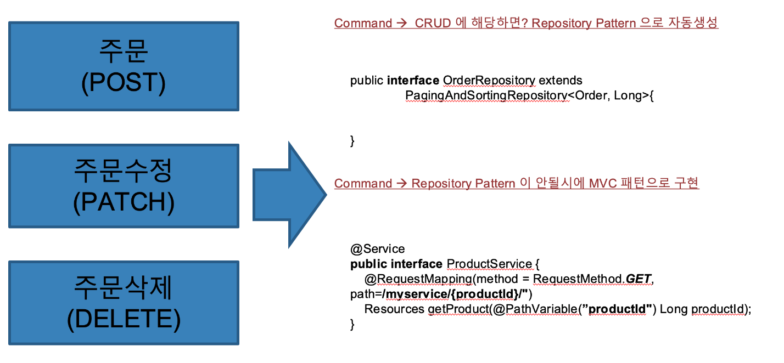{width="6.491666666666666in"
> height="3.0083333333333333in"}

##### Event - Orange

1)  주황색 스티커인 이벤트는 pojo 객체인 Java Class 로 생성을 한다.

> 실제로 메세지로 주고 받을때는 json 객체 형식으로 통신하는 방법을
> 추천한다. Json 객체를 직접 만들거나, String 변수처럼 바로 선언을 할
> 수도 있으나, 클레스 파일로 구성을 해 놓았을시, 명시적이고 쉽게변경하기
> 어렵다.
>
> 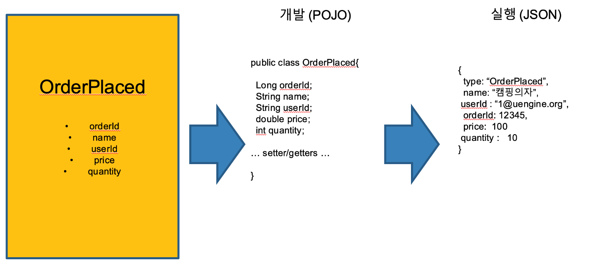{width="6.483333333333333in"
> height="2.933333333333333in"}

2)  이벤트는 Aggregate 의 변화에 의해서 발생하기 때문에, 이벤트를 보내는
    로직은 Entity의 lifecycle 에 작성을 하게 된다. 물론 비지니스 로직의
    중간중간에 이벤트를 발생시켜야 한다면, 따로 서비스에서 처리를
    하는것이 맞으나, DDD 에서 말하는 주요 문구인 도메인을 보았을때
    비지니스가 보여야 한다는 원칙에 마추어 Entity 에서 이벤트를 발생하는
    방법을 추천한다.

> JPA 에서는 이러한 Entity 의 lifecycle에 해당하는 listener 를
> 어노테이션으로 생성하여 놓았다. 대표적으로 \@PostPersist (저장후)
> \@PrePersist(저장전) \@PostUpdate (업데이트후) 등이 있다.
>
> 메세지를 send 하는 방법은 어떤 라이브러리를 쓰고, 설정에 따라
> 달라지지만 메세지 브로커를 kafka 를 사용한다면 topic 을 설정하고,
> 마지막에 send 하는 형식으로 이벤트를 발행한다.
>
> 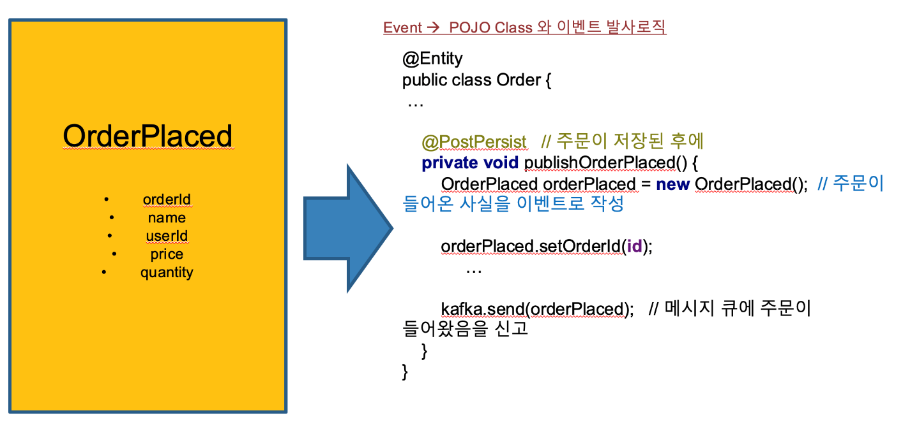{width="6.483333333333333in"
> height="3.0416666666666665in"}

##### Policy - Lilac

1)  보라색 스티커는 이벤트에 반응하여 작동하는 Policy 이다. 이벤트에
    반응하기 때문에 이벤트를 수신하는 리스너가 필요하다.
    Spring-cloud-Stream 을 사용시 아래처럼 \@StreamListener
    어노테이션으로 선언을 하여 주면, 이벤트가 생성될때마다 INPUT 으로
    들어오는 데이터를 한개씩 수신이 된다.

> Porcessor.INPUT 은 메세지를 수신하는 채널인데, kafka 의 구현체를
> 가진다면 topic 을 의미한다. 만약 Topic 을 여러 이벤트에서 공유를
> 한다면 아래 리스너에서 내가 원하는 이벤트만 선별하여 작업을 해야하기
> 때문에 이벤트의 속성값에서 정해진 이벤트 명을 찾던가, header 에서
> 찾는등 이벤트를 구분하는 로직이 필요하다.
>
> 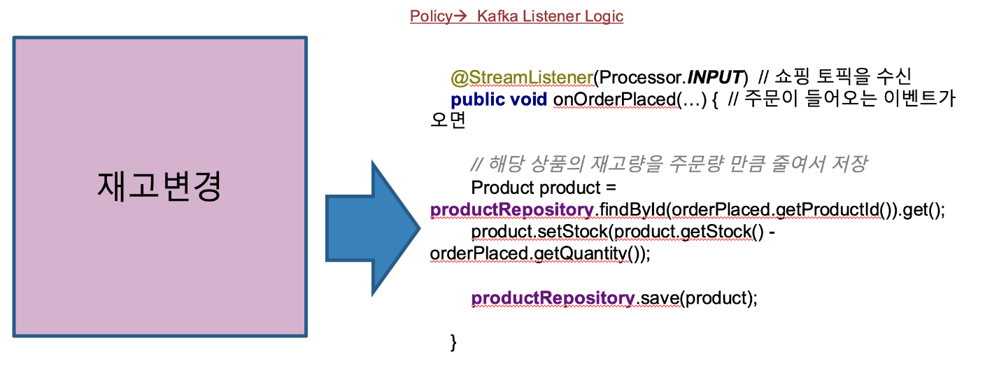{width="6.483333333333333in"
> height="2.5in"}

##### Bounded Context

1)  이벤트 스토밍을 하고 난 후에 여러 Aggregate 들이 관련된 Context 끼리
    묶여서 Bounded Context 가 형성이 된다. 이것은 마이크로 서비스 단위로
    쪼갤수 있는 후보가 된다.\
    \
    마이크로 서비스는 java 언어로 구현시 가장적합한 프레임워크는
    Spring-boot 이다. 내장된 톰켓으로 자체 서버를 띄울수 있고,
    라이브러리를 추가하는 방식으로 Chassis 구성을 손쉽게 할 수 있다.

EventStorming2Code 기반 MSA 개발
================================

예제 프로젝트
-------------

예제 프로젝트는 주문 서비스와 배송 서비스 2개의 서비스를
EventStorming하여 Spring-boot로 실행되는 Java Project를 생성한다.

UI 소개
-------

### 도구 레이아웃

EventStorming2Code 도구의 전체 화면 레이아웃은 다음과 같다.

{width="5.933333333333334in" height="3.65in"}

그림 19 도구 전체 레이아웃

  번호   이름               기능 설명
  ------ ------------------ -----------------------------------------------------------
  1      Zoom Panel         캔버스에 작성된 화면을 확대 및 축소 기능
  2      Code Preview       Code를 생성 및 확인 가능한 기능
  3      Download Archive   Code를 생성 및 다운로드 가능한 기능
  4      Project Name       프로젝트 명 입력 (Java의 경우 Package명)
  5      Upload             저장된 Json형태의 EventStorming파일을 불러오는 기능
  6      Save               Draw된 EventStorming파일을 Json파일로 저장함
  7      Sticker Palette    EventStorming을 위한 Sticky note를 선택할 수 있는 Palette
  8      Canvas             Sticky note를 붙이는 Canvas

### Event

Event는 스티커 팔레트에서 주황색 아이콘이 지칭한다.

#### Event 추가하기

스티커 팔레트에서 주황색 아이콘을 캔버스로 Drag & Drop하여 Event를
추가한다.

{width="6.491666666666666in"
height="4.258333333333334in"}그림 20 Event Drag

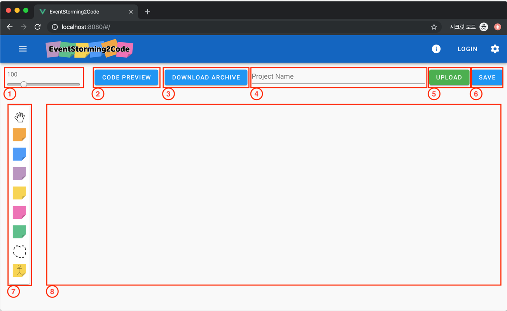{width="6.5in" height="4.275in"}그림 21 Event Drop

#### Event 속성 설정

추가된 Event 스티커를 더블 클릭하게 되면, 오른쪽에 아래와 같이 속성창이
나타나며, 각 속성 설정에 대한 값은 아래와 같다.

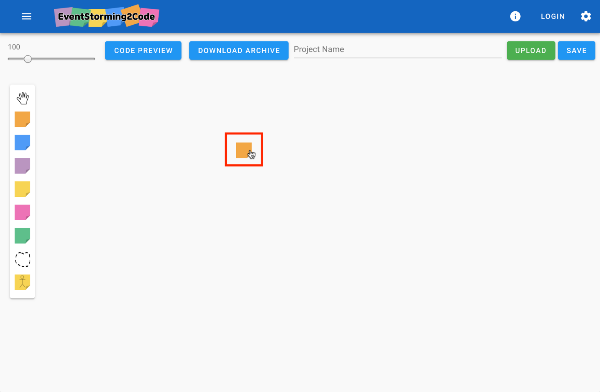{width="6.5in" height="5.133333333333334in"}그림
22 Event Property Panel

  번호   이름                   기능 설명
  ------ ---------------------- ---------------------------------
  1      Event Name             Event Sticky note에 작성될 이름
  2      Trigger                Event가 발생할때 발생할 Trigger
  3      Attribute              Event의 Attribute들 등록
  4      Associated Aggregate   Event와 연결 될 Aggregate 선택

주문팀의 주문 시나리오에 따라 아래와 같이 기입한다.

1.  Event Name에 "**OrderPlaced**" 라고 기입한다.

2.  Trigger는 PrePersist를 선택한다.

3.  Attribute는 Event에서 사용할 Entity를 등록한다.\
    기본적으로는 아래의 4. 에서 Aggregate가 연결된다면 해당 Aggregate의
    Entity정보를 참조한다.

4.  연결될 Aggregate를 선택한다. (이후에, Aggregate를 추가한 후에
    선택하여준다.)

배송팀은 배송 시나리오에 따라 Event를 생성하여 준다.

1.  Event Name에 "**DeliveryStarted**" 라고 기입한다.

2.  Trigger는 PostUpdate를 선택한다.

3.  Attribute는 Event에서 사용할 Entity를 등록한다.\
    기본적으로는 아래의 4. 에서 Aggregate가 연결된다면 해당 Aggregate의
    Entity정보를 참조한다.

4.  연결될 Aggregate를 선택한다. (이후에, Aggregate를 추가한 후에
    선택하여준다.)

### Policy

Policy는 스티커 팔레트에서 라일락색 아이콘이 지칭한다.

#### Policy 추가하기

스티커 팔레트에서 라일락색 아이콘을 캔버스로 Drag & Drop하여 Policy를
추가한다

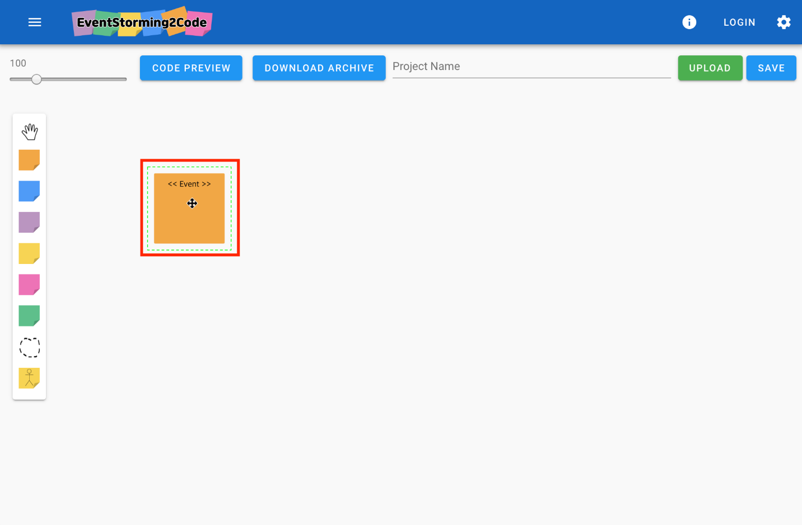{width="0.69375in"
height="0.6069444444444444in"}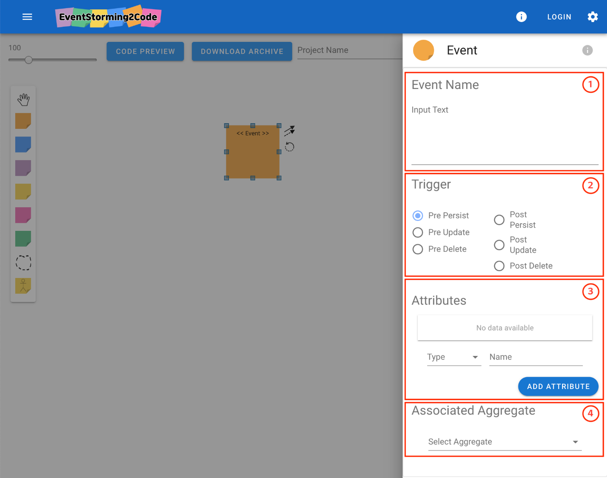{width="6.5in"
height="3.4833333333333334in"}그림 23 Policy Drag

{width="0.69375in"
height="0.6069444444444444in"}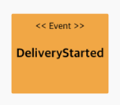{width="6.5in"
height="3.308333333333333in"}그림 24 Policy Drop

#### Policy 속성 설정

추가된 Policy 스티커를 더블 클릭하게 되면, 오른쪽에 아래와 같이 속성창이
나타나며, 각 속성 설정에 대한 값은 아래와 같다.

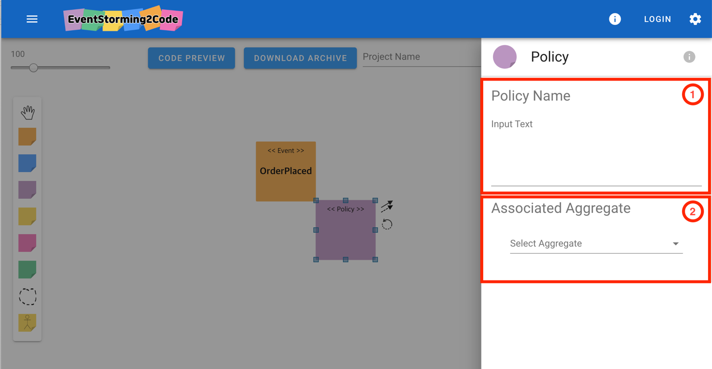{width="6.5in" height="3.375in"}그림 25 Policy
Property Panel

  번호   이름                   기능 설명
  ------ ---------------------- ----------------------------------
  1      Policy Name            Policy Sticky note에 작성될 이름
  2      Associated Aggregate   Policy와 연결 될 Aggregate 선택

해당 이벤트가 발생될때의 업무에 따라서, 아래와 같이 기입한다.

1.  Policy Name에 "**StartDeilvery**" 라고 기입한다.

2.  연결될 Aggregate를 선택한다. (이후에, Aggregate를 추가한 후에
    선택하여준다.)

### Command

Command는 스티커 팔레트에서 파란색 아이콘이 지칭한다.

#### Command 추가하기

스티커 팔레트에서 파란색 아이콘을 캔버스로 Drag & Drop하여 Command를
추가한다

{width="0.69375in"
height="0.6069444444444444in"}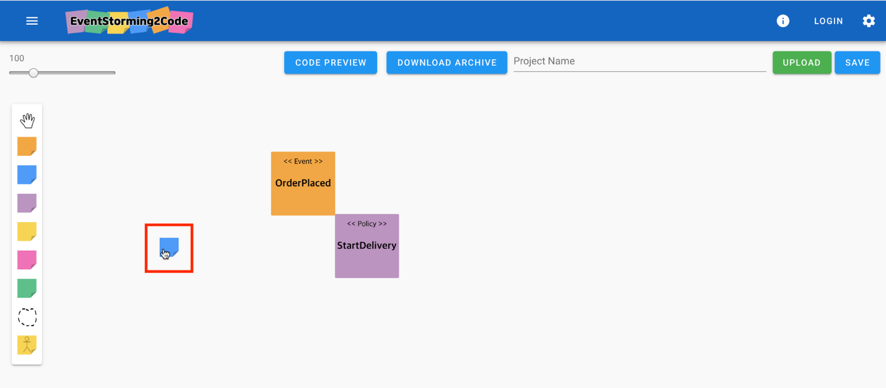{width="6.5in"
height="2.85in"}그림 26 Command Drag

{width="0.69375in"
height="0.6069444444444444in"}{width="6.491666666666666in"
height="3.0416666666666665in"}그림 27 Command Drop

#### Command 속성 설정

추가된 Command 스티커를 더블 클릭하게 되면, 오른쪽에 아래와 같이
속성창이 나타나며, 각 속성 설정에 대한 값은 아래와 같다.

{width="0.69375in"
height="0.6069444444444444in"}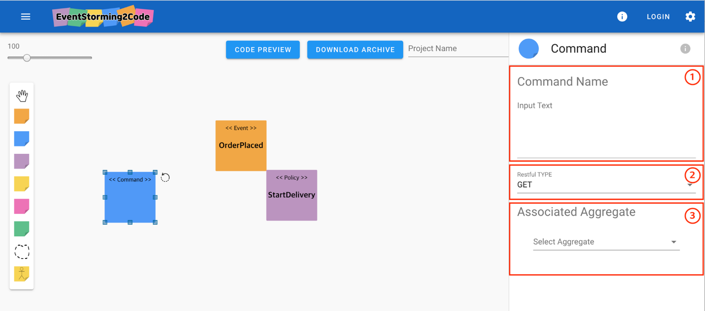{width="6.5in"
height="2.875in"}그림 28 Command Property Panel

  번호   이름                   기능 설명
  ------ ---------------------- -----------------------------------
  1      Command Name           Command Sticky note에 작성될 이름
  2      Restful Type           Restful API 의 CRUD Type을 선택
  3      Associated Aggregate   Command와 연결 될 Aggregate 선택

해당 이벤트가 발생될때의 업무에 따라서, 아래와 같이 기입한다.

1.  Command Name에 "**CreateOrder**" 라고 기입한다.

2.  Restful Type은 POST로 설정한다.

3.  연결될 Aggregate를 선택한다. (이후에, Aggregate를 추가한 후에
    선택하여준다.)

### 어그리게잇 (Aggregate)

Aggregate는 스티커 팔레트에서 노란색 아이콘이 지칭한다.

#### 어그리게잇 추가하기

스티커 팔레트에서 노란색 아이콘을 캔버스로 Drag & Drop하여 Aggregate를
추가한다

{width="0.69375in"
height="0.6069444444444444in"}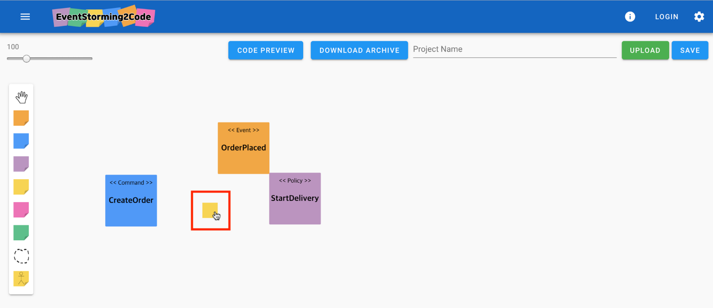{width="6.5in"
height="2.808333333333333in"}그림 29 Aggregate Drag

{width="0.69375in"
height="0.6069444444444444in"}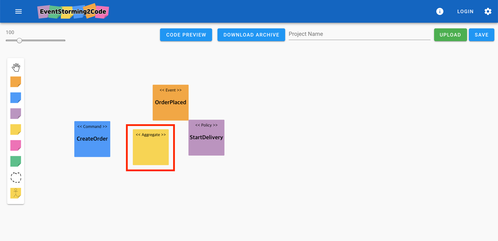{width="6.5in"
height="3.15in"}그림 30 Aggregate Drop

#### 어그리게잇 속성 설정

추가된 Aggregate 스티커를 더블 클릭하게 되면, 오른쪽에 아래와 같이
속성창이 나타나며, 각 속성 설정에 대한 값은 아래와 같다.

{width="0.69375in"
height="0.6069444444444444in"}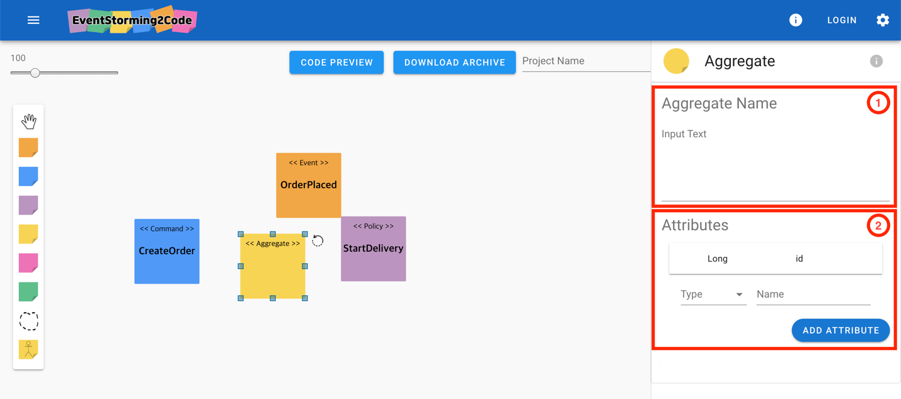{width="6.5in"
height="2.875in"}그림 31 Aggregate Property Panel

  번호   이름             기능 설명
  ------ ---------------- ----------------------------------------------
  1      Aggregate Name   Aggregate Sticky note에 작성될 이름
  2      Attributes       Aggregate Entity (Domain Entity)를 정의한다.

주문 서비스의 Aggregate(Domain Entity)를 정의하기 위해, 아래와 같이
기입한다.

1.  Aggregate Name에 "**Order**" 라고 기입한다.

2.  Aggregate의 Entity(Domain Entity)를 정의하여 준다.\
    해당 서비스에서는 Type은 String인 Name이라는 Entity를 추가하여준다.

배송 서비스의 Aggregate(Domain Entity)를 정의하기 위해, 아래와 같이
기입한다.

1.  Aggregate Name에 "**Delivery**" 라고 기입한다.

2.  Aggregate의 Entity(Domain Entity)를 정의하여 준다.\
    해당 서비스에서는 Type은 String인 Address라는 Entity를 추가하여준다.

Aggregate를 추가 하였다면 각 Event, Command, Policy들의 Associate
Aggregate를 설정하여, Aggregate를 지정하여 준다.

### Bounded Context 

Bounded Context는 스티커 팔레트에서 점선모양의 아이콘이 지칭한다.

#### Bounded Context 추가하기

스티커 팔레트에서 점선모양의 아이콘을 캔버스로 Drag & Drop하여 Bounded
Context를 추가한다

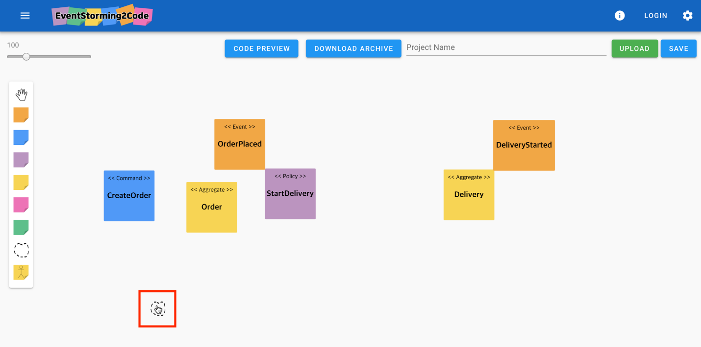{width="6.5in" height="3.225in"}그림 32
BoundedContext Drag

{width="6.491666666666666in"
height="3.966666666666667in"}그림 33 BoundedContext Drop

#### Bounded Context 속성 설정

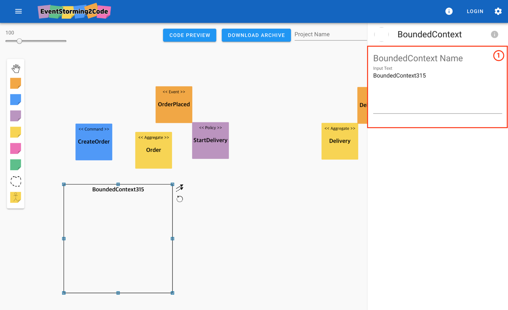{width="6.5in" height="3.975in"}그림 34
BoundedContext Property Panel

  번호   이름                  기능 설명
  ------ --------------------- ------------------------------
  1      BoundedContext Name   BoundedContext에 작성될 이름

주문 서비스의 Bounded Context와 배송 서비스의 Bounded Context를 그린 후,
각각의 서비스에 맞게 EventStorming의 Sticky Note들을 각 Bounded
Context에 Drag & Drop으로 넣어준다.

상기 작성된 4.2.2 부터 4.2.6까지의 작업을 완료하면 아래와 같은 형태의
EventStorming 결과물이 나온다.

### Relation

Relation은Event 스티커에서 Policy 스티커로 연결되는 선을 지칭한다.

#### Relation 추가

Event 스티커에서 화살표모양 아이콘을 선택, 또는 Drag 하여 연결될 Policy
스티커를 선택 또는 Drop하면 연결된다.

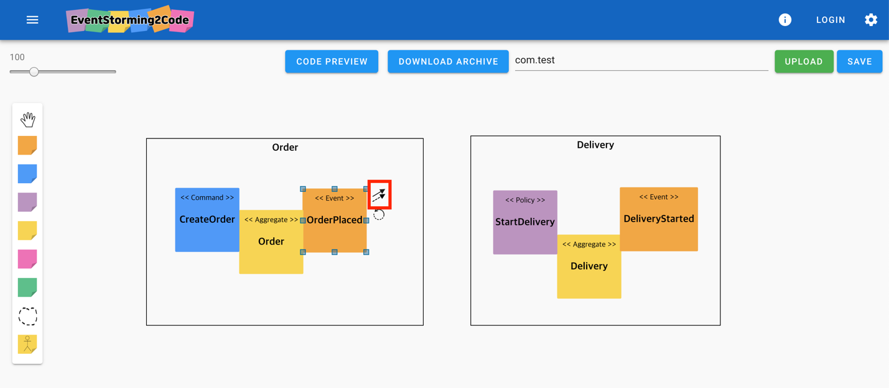{width="6.5in" height="2.85in"}그림 35 Relation
선택 또는 Drag

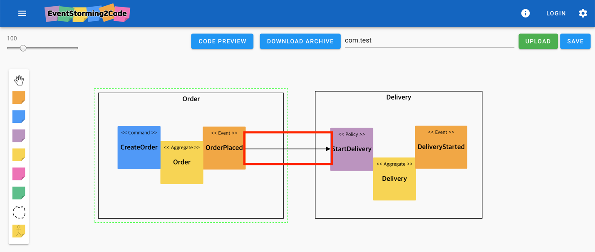{width="6.5in" height="2.75in"}그림 36 Policy 선택
또는 Drop

#### Relation 속성 설정

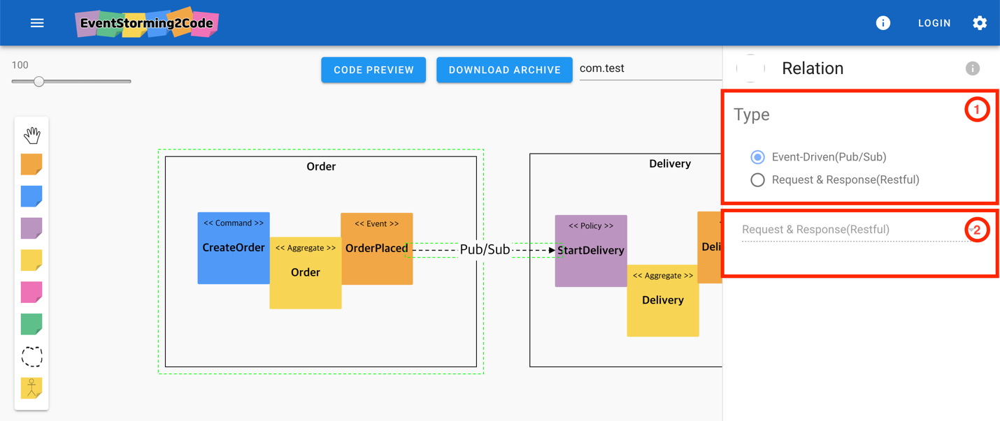{width="6.5in" height="2.7333333333333334in"}그림
37 Relation Property Panel

  번호   이름           기능 설명
  ------ -------------- -----------------------------------------------------------------------------------------------------------------------
  1      Type           Event-Driven형식의 Pub/Sub 방식을 사용할 것인지, 또는 Request & Response 방식의 Restful API 방식을 사용할 것인지 설정
  2      Restful Type   1번의 Type이 Request & Response 방식일 경우 CRUD중 어떠한 것을 사용할 것인지 설정

주문 서비스의 OrderPlaced의 이벤트가 발생할 경우 StartDelivery가
시작되도록 연결하는데, 어떠한 방식으로 StartDelivery를 시작하게 할
것인지를 설정하여 준다.

1.  Event-Driven 방식의 Pub/Sub 방식으로 설정하여 준다.

### EventStorming 결과

위의 이벤트 스토밍이 완료되면 아래 그림과 같이 나온다.

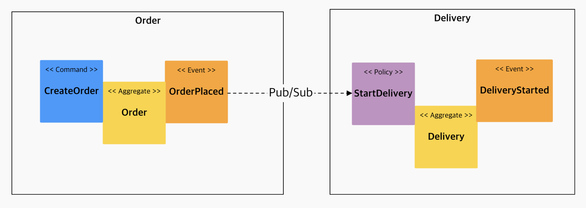{width="6.5in" height="2.316666666666667in"}그림
38 EventStorming 결과

### 코드 프리뷰

Code Preview를 선택하면 EventStorming 된 결과를 Code Preview를 통하여
Code로 변환된 결과를 확인 할 수 있다.

#### 코드 프리뷰 레이아웃

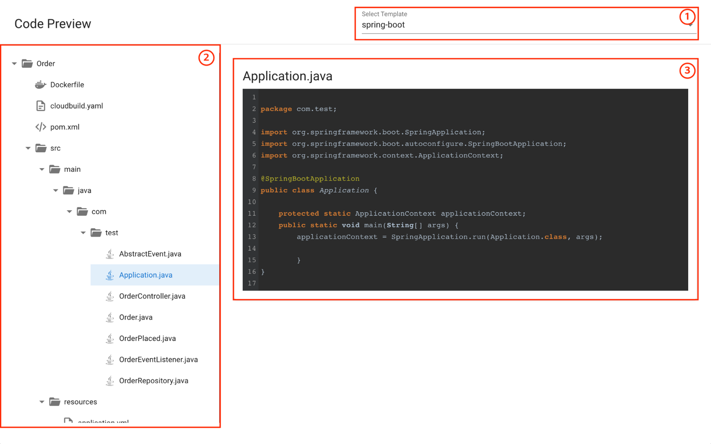{width="6.5in" height="4.066666666666666in"}

그림 39 코드 프리뷰 레이아웃

  번호   이름              기능 설명
  ------ ----------------- ---------------------------------------------------------------------------------
  1      Select Template   Template 중에서 어떤 Template을 사용하여 코드 생성 및 코드 확인 할 것인지 선택.
  2      Code List         선택된 Template에 따라서 생성된 폴더구조와 파일들을 보여줌.
  3      Code View         선택된 파일의 Code를 표시해줌.

### 다운로드 아카이브

Download Archive를 선택하면 Template을 선택할 수 있으며, EventStroming
된 결과를 Zip파일로 다운로드 받을 수 있다.

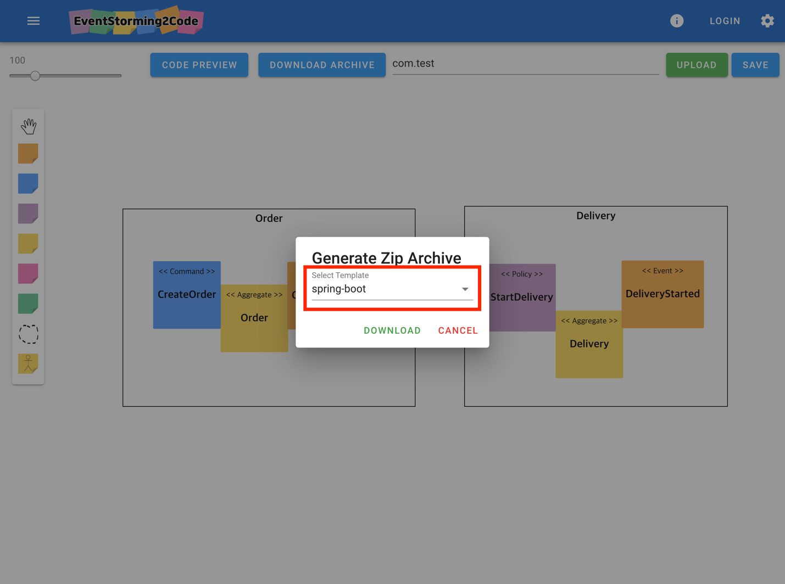{width="6.5in" height="4.833333333333333in"}그림
40 Download Archive 템플릿 선택

  번호   이름              기능 설명
  ------ ----------------- ----------------------------------------------------------------------------------
  1      Select Template   Template 중에서 어떤 Template을 사용하여 코드 생성 및 다운로드 받을 것인지 선택.

### 빌드

#### 다운로드 파일 구조 설명

-   Bounded Context 에 설정한 이름별(Order, Delivery)로 프로젝트가
    생성이 되었고, 압축을 풀었을시 아래와 같은 구조를 가진다.

-   {width="2.6083333333333334in"
    height="1.0666666666666667in"}

-   gateway 는 기본 제공되는 템플릿으로 spring-cloud-gateway 를 설정하는
    방법을 나타내고있다. 정상적으로 사용시에는 gateway/src/main/resource
    의 application.yaml 파일에서 routes 부분을 수정하여 사용하여야 한다.

-   파일 구조는 아래와 같이 스티커별로 기본 템플릿에 의하여 생성이
    되었다.\
    spring-boot 기반의 프로젝트 이며, maven 으로 리소스 관리를 한다.\
    파일 생성 위치나, 파일안의 기본 내용을 생성시마다 변경을 하려면
    다음장의 커스텀 템플릿을 활용하면 된다.

> {width="3.8916666666666666in"
> height="3.7583333333333333in"}

-   application.yaml

    -   spring-boot 의 설정파일이며, local 환경변수와 docker용
        환경변수를 profile 설정으로 분리하였다.

    -   이벤트 기반이기 때문에 메세지 처리를 위하여 spring-cloud-stream
        라이브러리를 사용한다. 그중에서 브로커를 kafka 를 사용하여
        설정되어있다.

-   Dockerfile

    -   docker image 를 생성할때 필요한 파일이다.

    -   Docker 로 build 시 \"\--spring.profiles.active=docker\" 로
        설정되어있어서 application.yaml 파일에서 설정한 프로파일을 읽게
        된다.

-   cloudbuild.yaml

    -   Google Cloud Build 에서 사용하는 pipeline 파일이다.

    -   기본설정으로 test-build-docker build-publish-deploy 단계가
        설정되어있다.

    -   Docker publish 단계에서는 GCR (Google Container Registry) 에
        이미지를 배포한다.

    -   Deploy 단계에서는 GKE 에 배포를 하게 되는데 이때 주의사항은
        클러스터 이름과 Zone 을 설정해 줘야한다. 아래 3가지 항목을
        사용자에 마추어 필수적으로 변경을 해줘야 한다.

        -   substitutions.\_PROJECT\_NAME: 항목에서 어떤 service 와
            deploy 명으로 배포를 할지 정해지는데, 해당 부분을 변경해
            줘야한다.

        -   CLOUDSDK\_COMPUTE\_ZON: 설정되어있는 Zone 은
            도쿄(asia-northeast1-a) 로 설정이 되어있다.

        -   CLOUDSDK\_CONTAINER\_CLUSTER: 클러스터 이름은
            standard-cluster-1 으로 default 클러스터 이름이다.

#### 선행사항

-   maven 설치

-   local kafka 실행 -- localhost:9092

#### 실행

-   메이븐 프로젝트이기 때문에 mvn spring-boot:run 으로 실행을 한다.

-   정상적으로 실행이 되었다면 브라우저에 localhost:8081 (port 는
    프로젝트별로 다르기 때문에 설정파일 참조) 을 적어보면 Aggregate 에
    설정하였던 속성값들이 HATEOAS 수준으로 정상적으로 나오는지를
    확인한다.

-   Command 에 작성하였던 get,post 등의 메서드가 정상적으로 호출되는지
    확인한다.

### 클라우드 배포

이번 가이드항목은 작동하는 소스코드를 github 에 올리고 GCB 트리거를
생성하여 자동 빌드되고 배포되는 방법을 guide 한다.

####  Git 연동

-   GCB 는 git repository 를 현재까지 github, google code, bitbucket 을
    지원한다. 본 가이드는 이중에서 github 에 코드를 넣는 방법을
    설명한다.

-   [[https://github.com/]{.underline}](https://github.com/) 에서
    레파지토리를 생성한다.

-   레파지토리를 생성 하고 git 주소가 생성이 된다

-   github 에 올리려는 프로젝트에서 아래와 같은 스크립트를 실행하여
    github 에 source 를 push 한다.

-   git init

-   git commit --m 'commit message' .

-   git push \<github 주소\>

#### GCB Trigger 생성

GCB 트리거 생성은 아래와 같은 순서대로 진행을 한다.

###### GCP 의 GCB 메뉴로 들어가서 트리거 메뉴를 클릭한다.

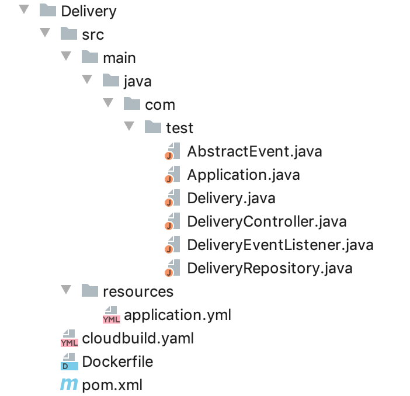{width="1.7916666666666667in"
height="2.091666666666667in"}

###### 상단의 저장소 연결 버튼을 클릭한다

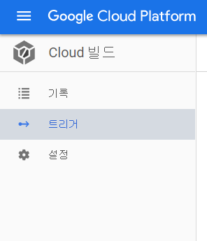{width="4.7in" height="1.7416666666666667in"}

###### 저장소 선택에서 github을 선택한다.

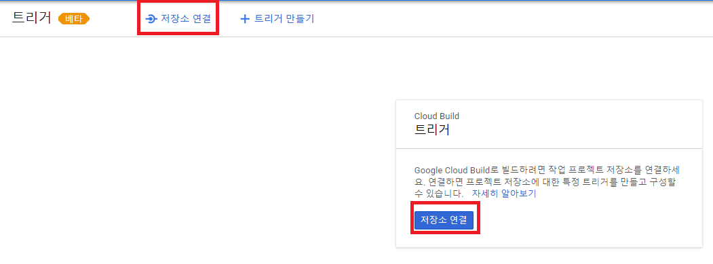{width="3.975in" height="2.475in"}

###### 깃헙 인증을 하여 진행한다.

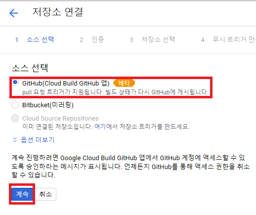{width="3.975in" height="2.966666666666667in"}

###### 연결할 프로젝트를 선택하여 저장소 연결을 마무리 한다.

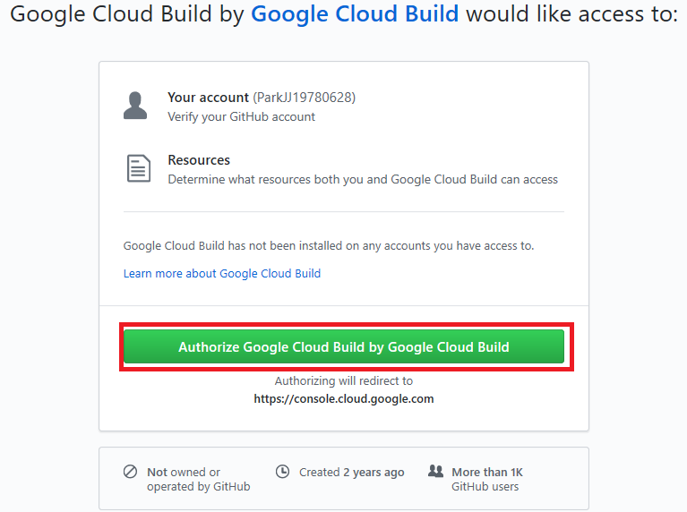{width="3.975in" height="2.75in"}

###### 상단의 트리거 생성 버튼을 클릭하여 트리거를 생성한다.

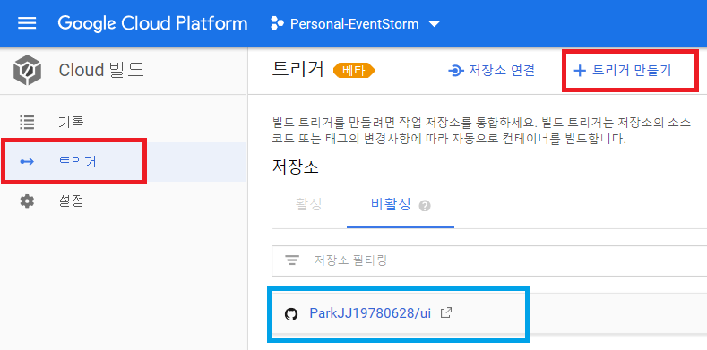{width="4.066666666666666in"
height="2.0166666666666666in"}

###### 트리거 생성 화면의 하단에 빌드 구성을 CloudBuild 로 선택한다.

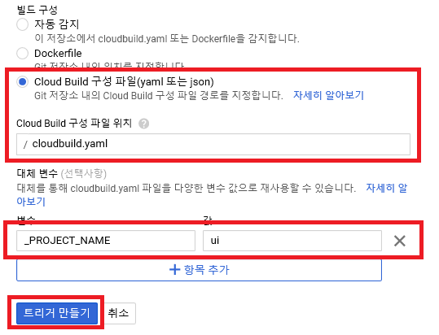{width="5.066666666666666in"
height="2.4916666666666667in"}

###### 트리거 만들기 버튼을 클릭하여 트리거생성을 완료한다. 오른쪽의 트리거 실행버튼으로 바로 트리거 실행을 할 수 있다. 

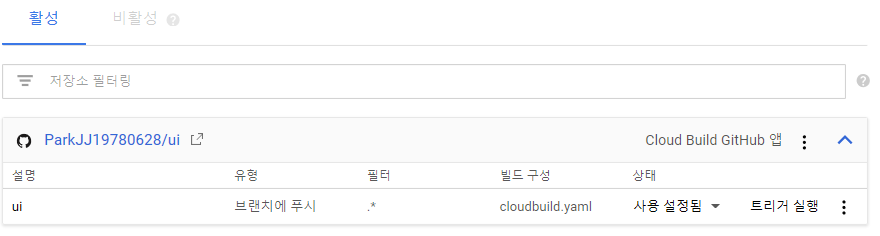{width="5.075in" height="1.4in"}

###### 위와같이 트리거를 생성하였으면, github 에 push 명령을 실행할때마다, 트리거가 작동하는 것을 확인 할 수 있다.

#### 쿠버네티스 배포

##### 쿠버네티스 배포 확인

-   트리거가 정상적으로 실행을 하였으면 기록 메뉴에서 빌드 성공/실패
    여부를 확인 할 수있다.

> 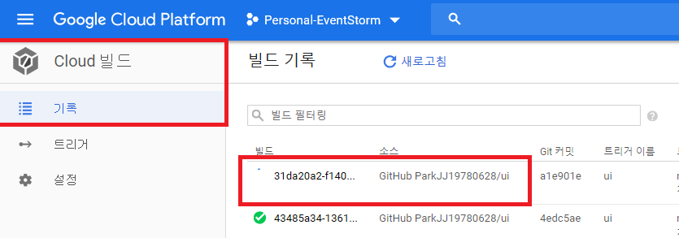{width="5.091666666666667in"
> height="1.7833333333333334in"}

-   빌드 기록에 녹색으로 성공화면이 떠있으면 GKE 에 성공적으로 배포가 된
    것이다. GKE 메뉴의 작업 부하 항목에서 현재 동작하는 서비스를 확인 할
    수 있다.

> 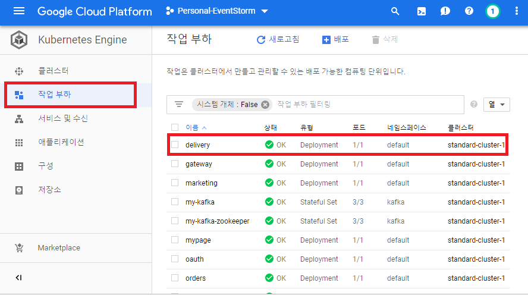{width="5.033333333333333in"
> height="2.808333333333333in"}

##### 배포 실패시 해결방법

###### 빌드 실패시 기록 항목에서 아래와 같이 빨간색으로 빌드 실패가 나타나고, 클릭시 어떤 step 에서 에러가 났는지 확인이 가능하다. 로그 다운로드 버튼을 눌러서 상세 로그를 확인하면서 해결이 가능하다.

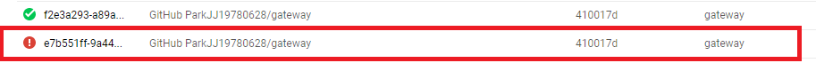{width="6.25in" height="0.48333333333333334in"}

{width="6.5in" height="3.058333333333333in"}

###### deploy 단계에서 에러가 났을 경우 첫번째로 GCB 에서 GKE 로 배포를 하는 권한이 있는지 체크해 보고, 없을때 권한 설정을 해준다.

> Cloud빌드 -- 설정 메뉴에서 Kubernetes Engine 개발자가 사용설정됨 으로
> 상태가 보이는지 확인하고, 안되어있을시 사용 설정한다.

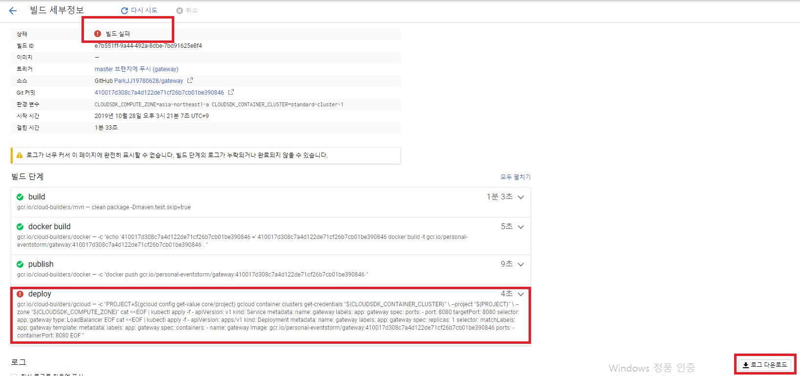{width="5.658333333333333in" height="3.2in"}

###### cloudBuild.yaml 파일의 option 부분에 클러스터 Zone 과 이름이 일치하는지 확인 한다.

**options**:\
**env**:\
*\# \# location/name of GKE cluster (used by all kubectl commands)\
*- CLOUDSDK\_COMPUTE\_ZONE=asia-northeast1-a\
- CLOUDSDK\_CONTAINER\_CLUSTER=standard-cluster-1

커스텀 템플릿 (Custom Template)
-------------------------------

### 개념

커스텀 템플릿은 기본 제공하는 템플릿 외에 원하는 템플릿을 추가하여
EventStorming결과를 원하는 템플릿에 맞추어 코드가 생성될 수 있도록 한다.

### 템플릿 추가

#### 템플릿 설명

EventStorming 된 결과를 원하는 Template으로 이용하기 위해서는, 커스텀
템플릿을 작성 하여야 한다. Template파일은 크게 생성관련 메타데이터,
소스코드부분 두가지로 나뉘어져 있으며, 메타데이터 부분과 소스코드 부분은
"\-\--" 로 나누어져 있다.

템플릿 생성은 기본적으로 {{ Mustache }} 엔진을 사용하며, Mustache는 {{
}} 안의 값을 Key 값으로 해당 Value값을 가지고 오는 엔진이다.

#### 템플릿 생성

목적: 예제로 HelloWorld.py파일을 생성하여 EventStoming 한 결과들을
print함수를 이용하여 각각 작성된 이름을 표시하여준다.

1.  HelloWorld.py 파일을 아래와 같이 생성한다.

+----------------------------------------------------------------+
| forEach: BoundedContext \-\-\-\-- 1                            |
|                                                                |
| fileName: HelloWorld.py \-\-\-\-- 2                            |
|                                                                |
| path: {{boundedContext}}/{{{options.packagePath}}} \-\-\-\-- 3 |
|                                                                |
| \-\--                                                          |
|                                                                |
| print(\"BoundedContext: {{name}}\");                           |
|                                                                |
| {{\#aggregates}}                                               |
|                                                                |
| print(\"Aggregate: {{name}}\");                                |
|                                                                |
| {{\#events}}                                                   |
|                                                                |
| print(\"event: {{name}}\");                                    |
|                                                                |
| {{/events}}                                                    |
|                                                                |
| {{\#commands}}                                                 |
|                                                                |
| print(\"command: {{name}}\");                                  |
|                                                                |
| {{/commands}}                                                  |
|                                                                |
| {{\#policies}}                                                 |
|                                                                |
| print(\"policy: {{name}}\");                                   |
|                                                                |
| {{/policies}}                                                  |
|                                                                |
| {{/aggregates}}                                                |
+----------------------------------------------------------------+

각 메타데이터에 대한 값은 아래를 참고하여 작성하면 된다.

  번호   이름       기능 설명
  ------ ---------- ----------------------------
  1      forEach    해당파일의 생성 단위 객체.
  2      filename   해당파일의 생성 파일 명
  3      path       해당파일의 생성 경로

2.  작성된 HelloWorld.py 파일을 ./public/static/template/helloWorld 폴더
    안에 넣어준다.

3.  해당 Template을 넣어 준 뒤, 코드 프리뷰에서 템플릿 선택부분을
    확인하면 아래 그림과 같이 HelloWorld 템플릿이 추가된 것을 확인 할 수
    있다.

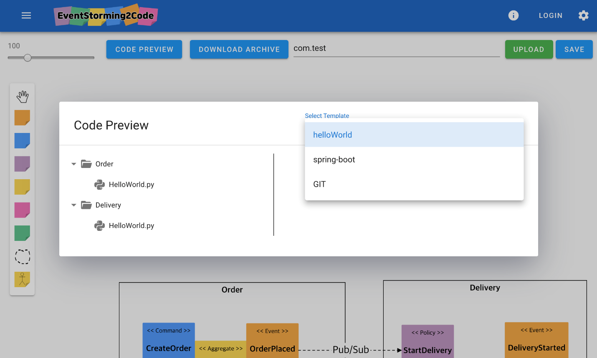{width="6.491666666666666in"
height="3.908333333333333in"}그림 41 HelloWorld 템플릿 선택

4.  각 Bounded Context 이름으로 된 폴더 안에 HelloWorld.py라는 파일이
    생성 된 것을 확인 할 수 있다.

5.  2개의 HelloWorld.py를 각각 확인 해본다.

{width="6.5in" height="3.941666666666667in"}그림
42 Order 폴더 하위의 HelloWorld.py

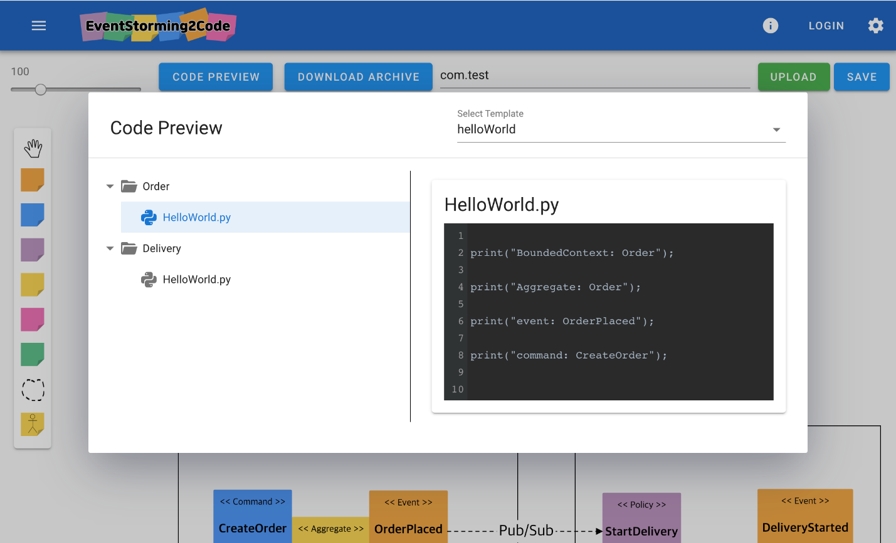{width="6.5in" height="3.925in"}그림 43 Delivery
폴더 하위의 HelloWorld.py

각각의 Bounded Context에 입력된 요소들의 이름을 정상적으로 print함수
안에 입력이 된 것을 확인 할 수 있다.

6.  해당 Template으로 작업된 내용을 다운로드 받아 실행해본다.

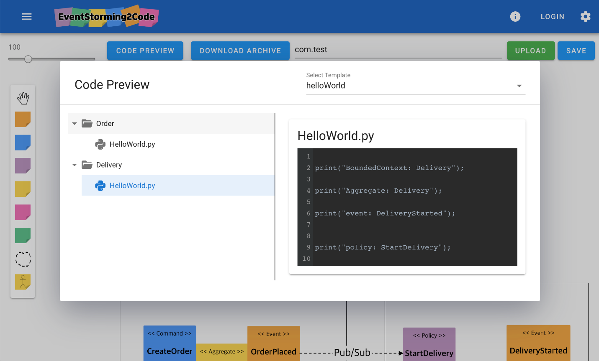{width="3.433333333333333in"
height="1.1916666666666667in"}

그림 44 Delivery 폴더 하위의 HelloWorld 실행 결과

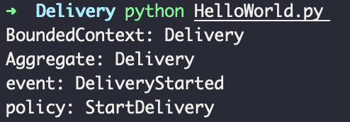{width="3.433333333333333in"
height="1.2833333333333334in"}

그림 45 Order 폴더 하위의 HelloWorld.py 실행 결과

7.  작성된 EventStorming을 통해, 각각의 Bounded Context 별로
    HelloWorld.py가 생성되며, HelloWorld.py안에 각각의 BoundedContext,
    Aggreagte, Event, Command, Policy들의 이름이 출력 되는 것을 확인 할
    수 있다.

#### 템플릿 작성 변수

##### 공통변수 (BoundedContext 제외)

  변수명                변수 역할
  --------------------- -------------------------------------------------------------
  name                  Sticky note에 작성된 이름
  nameCamelCase         Sticky note에 작성된 이름의 CamelCase 변환 결과
  namePascalCase        Sticky note에 작성된 이름의 PascalCase 변환 결과
  boundedContext        자신이 속해있는 BoundedContext 이름
  options.package       패키지 명 (ProjectName)
  options.packagePath   패키지 경로 ( java의 경우 src/main/java/{{ projectName }} )

##### BoundedContext 변수

+---------------+--------------------------------------------------+
| 변수명        | 변수 역할                                        |
+===============+==================================================+
| name          | BoundedContext 이름                              |
+---------------+--------------------------------------------------+
| aggregates    | 해당 BoundedContext 안에 속해있는 Aggregate 목록 |
|               |                                                  |
|               | (하단에 작성되는 Aggregate의 변수 사용 가능)     |
+---------------+--------------------------------------------------+
| portGenerated | 생성된 포트번호 (8081부터 시작됨)                |
+---------------+--------------------------------------------------+

##### Aggregate 변수

+-----------------------------------+-----------------------------------+
| 변수명                            | 변수 역할                         |
+===================================+===================================+
| aggregateRoot. fieldDescriptors   | Aggregate의 Entity 목록           |
+-----------------------------------+-----------------------------------+
| aggregateRoot.                    | Aggregate의 Key값                 |
| keyFieldDescriptors               |                                   |
+-----------------------------------+-----------------------------------+
| events                            | Aggregate에 속해있는 event 목록   |
|                                   |                                   |
|                                   | 하단에 작성되는 Event의 변수 사용 |
|                                   | 가능)                             |
+-----------------------------------+-----------------------------------+
| commands                          | Aggregate에 속해있는 command 목록 |
|                                   |                                   |
|                                   | 하단에 작성되는 Command의 변수    |
|                                   | 사용 가능)                        |
+-----------------------------------+-----------------------------------+
| policies                          | Aggregate에 속해있는 policy 목록  |
|                                   |                                   |
|                                   | 하단에 작성되는 Policy의 변수     |
|                                   | 사용 가능)                        |
+-----------------------------------+-----------------------------------+

##### Event 변수

  변수명             변수 역할
  ------------------ --------------------------------
  aggregate          자신이 속해있는 Aggregate 정보
  fieldDescriptors   Event Entity 목록
  eventToPolicy      Policy에 Event를 전달할 방식
  trigger            Event 전달방식에 관한 Trigger

##### Command 변수

  변수명        변수 역할
  ------------- --------------------------------
  aggregate     자신이 속해있는 Aggregate 정보
  restfulType   RestAPI 중 어떠한 방식인지.

##### Command 변수

  변수명              변수 역할
  ------------------- --------------------------------
  aggregate           자신이 속해있는 Aggregate 정보
  eventToPolicy       Policy가 Event를 전달받는 방식
  relationEventInfo   연결된 Event에 대한 정보
